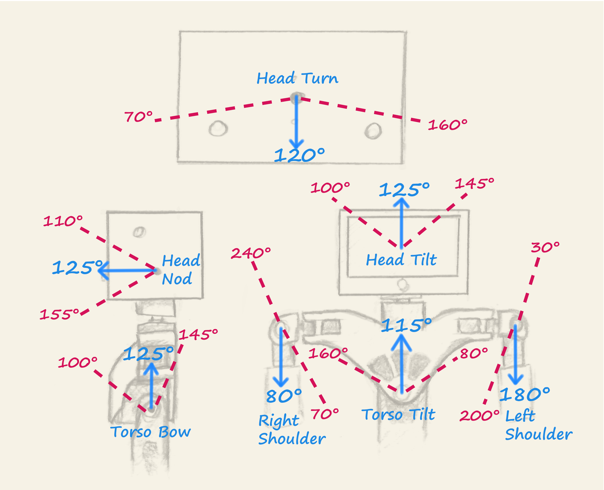

# Joint Rotation Ranges and Directionality

|     Joint Name       | ID | Home Angle | Minimum | Maximum |
|----------------------|----| ---------- | ------- | ------- |
| Head Tilt            | 01 | 125        | 100     | 145     |
| Head Nod             | 02 | 125        | 110     | 155     |
| Head Turn            | 03 | 120        | 70      | 160     |
| Right Chest          | 04 | 135        | 60      | 240     |
| Right Shoulder       | 05 | 85         | 70      | 240     |
| Right Bicep          | 06 | 115        |  |  |
| Right Elbow          | 07 | 90         | 20      | 115     |
| Left Chest           | 08 | 115        | 0       | 180     |
| Left Shoulder        | 09 | 180        | 30      | 200     |
| Left Bicep           | 10 | 115        |  |  |
| Left Elbow           | 11 | 105        | 60      | 180     |
| Right Hip            | 12 | 84         | 84      | 170     |
| Right Knee           | 13 | 90         | 90      | 180     |
| Right Ankle          | 14 | 80         | 60      | 100     |
| Left Hip             | 15 | 96         | 10      | 96      |
| Left Knee            | 16 | 80         | 0       | 80      |
| Left Ankle           | 17 | 90         | 70      | 110     |
| Torso Tilt           | 18 | 115        | 80      | 160     |
| Torso Bow            | 19 | 125        | 100     | 145     |
| Right Gripper        | 20 | 0          |  |  |
| Left Gripper         | 21 | 0          |  |  |