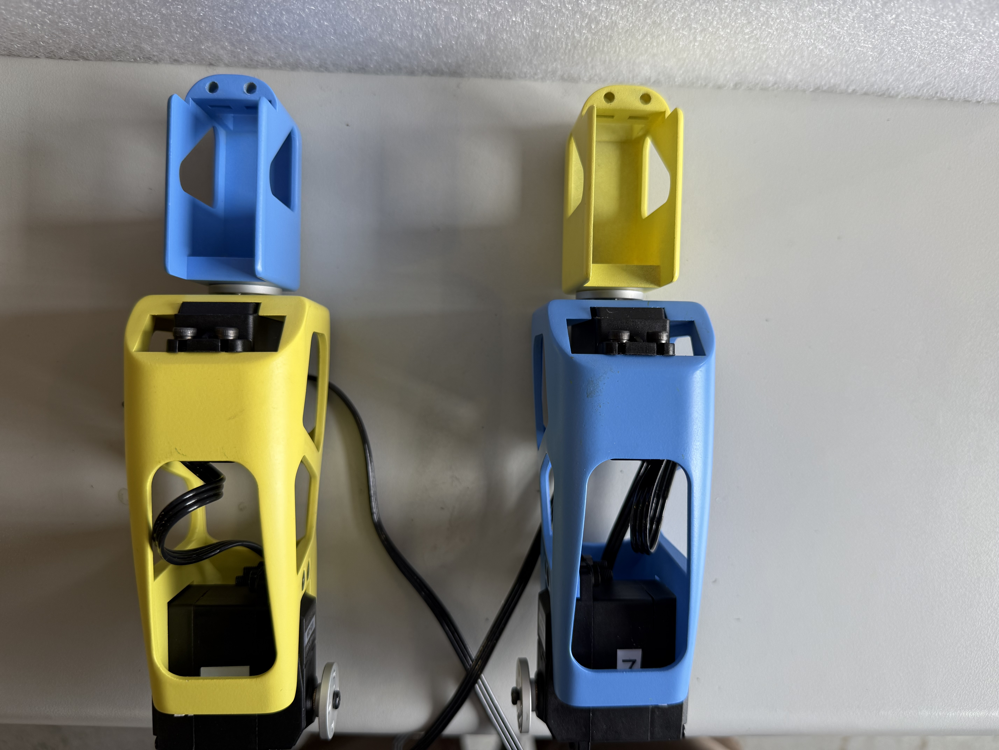
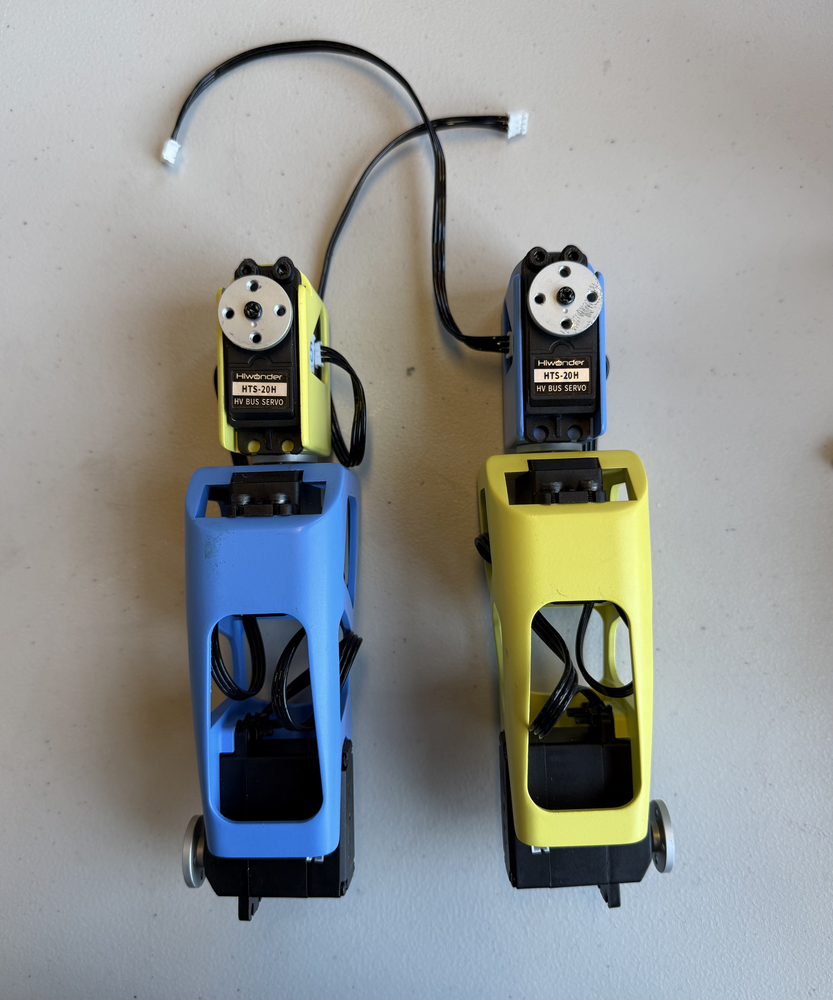
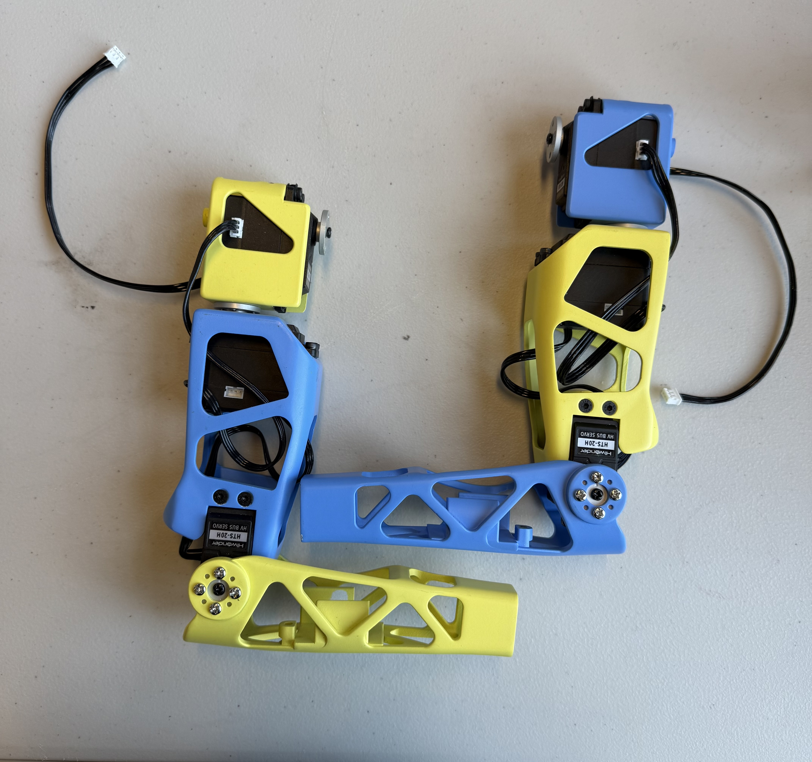
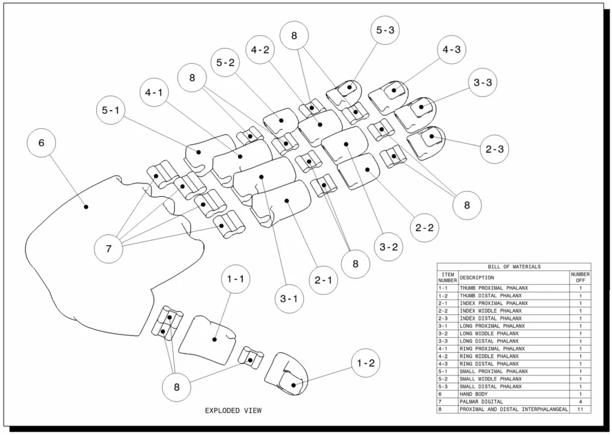
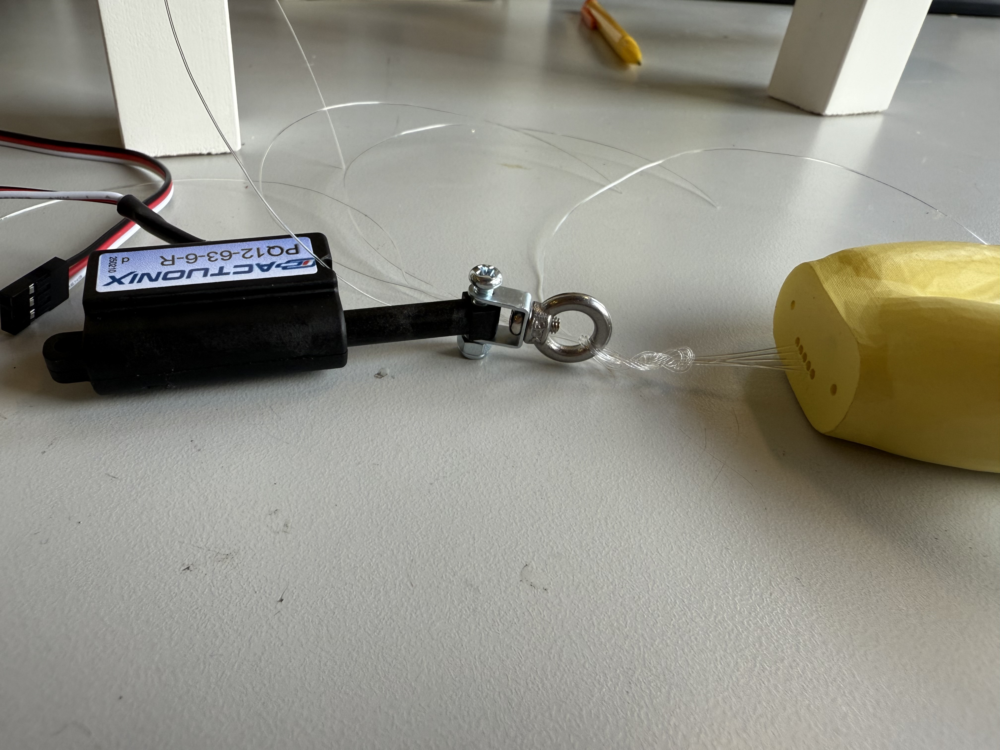
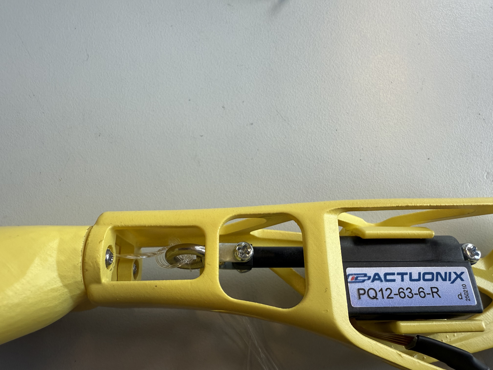

# Assembling the Arms and Hands
When assembling the arms for the robot, it is best to begin with the bicep, then shoulder, and ending with the forearms. This is due to the slight complexity behind the arm assembly. You will need to attach the motors and JST cables onto certain pieces before moving on.

The first step that is **highly** recommended is pre-setting all of the Arm motors before beginning the assembly. 

The HiWonder HTS-20H servos involved in this assembly would be:  
- Right Shoulder
- Right Bicep
- Right Elbow
- Left Shoulder
- Left Bicep
- Left Elbow 

The forearms will require one Actuonix PQ12 Micro Linear Actuator each. 

All correlated motor IDs are listed above in [Initializing Servo IDs and Positions](#initializing-servo-ids-and-positions), as well as instructions for how to set the IDs and their home positions. It is also recommended that you check the servo horn orientation during this time, following the alignment found here [Servo Horn Alignment](#servo-horn-alignment).

## Biceps
The biceps will require:
 - a M3 hex screwdriver
 - 2x servo horns
 - 2x black M3 screws from the motor package
 - 4x black rubber spacers from the motor package
 - 4x JST cables
 - 4x M3 x 18 mm tapered screws
 - 4x M3 x 25 mm hex screws
 - 4x M3 square nuts
 - 4x M3 hex nuts
 - Motor ID 10
 - Motor ID 6
 - Motor ID 7
 - Motor ID 11
 
As recommended with every step within the assembly, it is best to pre-thread the screw holes on the 3D printed parts.

<!--Beginning with the top motor placement on the bicep, attach 2 JST cables onto the back and right side of the Right Bicep motor (switching the right side to left for the Left Bicep motor). After completing this step, add the square nuts to their corresponding spaces on the inside of the Biceps. If you look at the screw hole from a top view, you shouldn’t be able to see the M3 square nuts. If you can, this means that the screw holes from the Bicep pieces and the nuts are not aligned correctly. After aligning the nuts correctly, place the motors into the top motor space which should give you a prescribed alignment. Screw the motors in place using the M3 x 25 mm screws. The placement should mimic the figure below:-->
1. Attach 2 JST cables onto the back and right side of motor 10, and 2 cables onto the back and left side of motor 6.
2. Insert 4 square nuts into the slots located on the inside of the Biceps. Align them so you can't see them from the top.
3. Insert motors 10 and 6 into the Bicep pieces, secure them with 4 M3 x 25 mm screws.

Bicep references with JST cables:

<!--Next, add 2 rubber spacers to the screw holes opposite to where the servo attaches on the lower Bicep motors. Then, attach the lower Bicep motors to the lower motor placement available using the tapered M3 x 18 mm screws with their servo horns already included (using the black M3 screws). The motors should be aligned where the screw holes with the rubber spacers match up with the screw holes on the 3D printed piece. The end result should allow for the servo horn of the lower Bicep motors to be attached to the Forearms. Lastly, connect the JST cables located on the right or left side of the upper Bicep motors to the back available connection of the lower Bicep motors. The figures below will include highlighted JST cable paths.
The final products should look like the figure below:-->

4. Add 4 rubber spacers onto the top screw notches of motors 7 and 11.
5. Attach the motors onto the lower placement of the Bicep pieces using 4 M3 x 18 mm tapered screws. Secure them with 4 M3 hex nuts.
6. Connect the side JST cables of the upper motors to the back connection of the lower motors.

Final products (Right motor and Left motor):

## Shoulders
The Shoulders will require:
 - a M3 hex screwdriver
 - 8x silver servo horn M3 screws
 - 2x black M3 screws from the motor package
 - 4x black rubber spacers from the motor package
 - 4x JST cables
 - 4x servo horns
 - 4x M3 x 16 mm hex screws
 - 4x M3 square nuts
 - Motor ID 4
 - Motor ID 9
 
As recommended with every step, it is best to pre-thread all screw holes. This is especially important for the Shoulders due to the uniqueness of its screw placements. 

<!--Before placing the Shoulder motors in the 3D printed piece, attach servo horns on the bottom of the 3D piece using the silver M3 screws. This will be the servo horns meant to connect to the upper motors of the Bicep assembly that you just completed. Make sure to align the horns correctly according to the upper Bicep motors. To make this step easier, feel free to attach the servo horns onto the upper Bicep motors, **don’t screw them down yet**. Then, screw the Shoulder piece onto the horn. The outcome should look like the figure below:-->

1. Attach servo horns using 8 silver M3 screws onto the bottoms of the Shoulder pieces. Point the servo horn dimple toward the front of the piece.

Outcome of servo horn attachment:

   
   

<!--Next, add rubber spacers to the screw holes closest to the servo horn attachment on the Shoulder motors. Put the Shoulder motors into the 3D printed piece with the label facing outward and the servo horn attachment orientated on the top. You can then screw the motors in place using the M3 x 14 mm hex screws and adding the M3 square nuts into their corresponding slots. It might take a bit of fussing to get the M3 square nuts aligned correctly with the screws. You can tilt the piece to help make this a bit easier.--> 

2. Add 4 rubber spacers onto motors 5 and 9, only on the top screw notches.
3. Insert motors 5 and 9 into the shoulders, screw them in place using 4 M3 x 14 mm hex screws and 4 M3 square nuts.

<!--After screwing the motor in place, you can screw on the servo horns and attach the JST cables (connected to the back of the upper Bicep motors) to the outer sides of the Shoulder motors. Right side for the Right Shoulder, and left side for the Left Shoulder. Additionally, attach JST cables to the inside of the Shoulder motors, which will later connect to the upper Chest motors. The figures below will include highlighted JST cable paths.-->

4. Attach servo horns and JST cables from the back of the upper Bicep motors to the outer sides of the Shoulder motors. Right side for Right Shoulder, Left side for Left Shoulder.
5. Attach 2 more JST cables to the inside of the Shoulder motors.

Final product:

   
   

## Forearms
The Forearms will require:
 - a M3 hex screwdriver
 - 8x silver M3 screws

Pre-thread all screw holes before assembly.

1. Attach Forearms to respective Biceps using 4 silver M3 screws each.

Final assembly (ignore color differences, pieces were printed incorrectly):

   

## Hands Construction & Assembly
Before beginning assembly, please be sure to double check that the hinges match the size-dependent and axial orientation on the fingers, with the fingers aligned to their corresponding palm (*Figures 1-3*). This assembly will require:
 - TPU finger hinges
 - Resin printed fingers
 - 0.38 mm (0.015 in) fishing line
 - 4 2.5 mm self-tapping screws (from the motor package)
 - pair of thin nose pliers
 - scissors
 - small files
 - 2 Actuonix PQ12 Micro Linear Actuators
 - 2 U-shaped metal pieces (from linear actuator box)
 - 2 M3 x 12 mm screws
 - 2 lock nuts
 - 2 square-shaped nuts
 - 2 eyebolts
 - 2 M3 small screws (from linear actuator box)
 - 2 M3 medium length screws (from linear actuator box)

<!--It is **highly** recommended to fit the largest hinges into the palm first. While the hinges should be printed as a more "spongey" material, you may need to use a pair of pliers to manually squeeze the larger side of the hinge into its gap in the palm. You can also use a file or a craft knife to trim a little from the opening sides. After fitting the palm hinges, all fingers can be assembled separately from the hand. They should perfectly slide into the finger hinge slots (following size contraints but axial orientation shouldn't matter).--> 
<!--Stringing the fishing line through the hands should be the **last step** (with fingers not yet assembled to the palm). Begin by measuring the amount you think you might need for your project by fitting the line through the bottom of the hand and up through the 3D piece (**do not cut yet**). Then, continue stringing your fishing line up the holes in the fingers and upon reaching the tip of the top finger, restring back through the second hole and leaving enough to tie it off (*Figure 4*). To get an accurate length of fishing line you will need, attach the finger to the palm and measure how much you think you will need at the bottom of the hand (leaving adequate space at the top to tie off your line). After ensuring you have the right length, you can cut off your line from its container and use pliers to tie a double knot at the top of the finger.-->

1. Fit the largest hinges into the 4 largest slots on the palm using the side with the hole in it. The material is "spongey", you can use pair of pliers to push it in. If necessary, shave the area use a small file or craft night.
2. Fit two small hinges into the thumb slot using the same process mentioned in step 1. If necessary, shave the area use a small file or craft night.
3. Slide first finger hinges in place following size constraints and hand orientation.
4. Repeat process using smaller hinges and finger components, referencing the figures below as needed.
5. Cut ~30 mm of fishing line per finger, ~25 mm for the thumb.
6. Fit fishing line through the bottom of the heand up through one set of finger components.
7. Restring fishing line back through the top finger component. Leave enough room to tie off later.
8. Ensure that the length is adequate enough to later attach to the forearm. If so, tie off the top of the finger using pliers to get a tight knot (may need to make more than one knot). Use Figure 4 as a reference.

*Figure 1*: Composition and BOM of Flexy-Hand 2 ([Flexy-Hand 2](https://www.thingiverse.com/thing:380665))

*Figure 2*: Finger plate with labeled orientation ([Flexy-Hand 2](https://www.thingiverse.com/thing:380665))

*Figure 3*: Hinge orientation for all fingers ([Flexy-Hand 2](https://www.thingiverse.com/thing:380665))

*Figure 4*: Tendon knot placement for all fingers ([Flexy-Hand 2](https://www.thingiverse.com/thing:380665))

*Figure 5*: Fisherman's Knot instructional image

### Continued...
9. Set up linear actuators to board and move them to max length before assembly. Follow Arduino code provided in [LinearActuatorSet](../Arduino/LinearActuatorSet/).

   

10. Attach eyebolts to middle screw hole of U-shaped metal piece using the smallest M3 screws from the linear actuator package.

   

11. Attach linear actuators to Forearm piece using M3 x 12 mm screws and square nuts (see Final product reference).
12. Tie all 5 fishing lines to eyebolt using a 'Fisherman's Knot'. Use Figure 5 as a reference.

   

12. Attach hands to the forearms using the 2.5 mm self-tapping screws.
13. Attach other 2 screw holes of U-shaped metal piece to linear actuator using the medium length M3 screws and lock nuts. *Note: This image is only meant to show how linear actuator and hand should be attached. Only attach the two once the linear actuator is screwed into the forearm.*

   

Final product (Right Arm):

   
   

