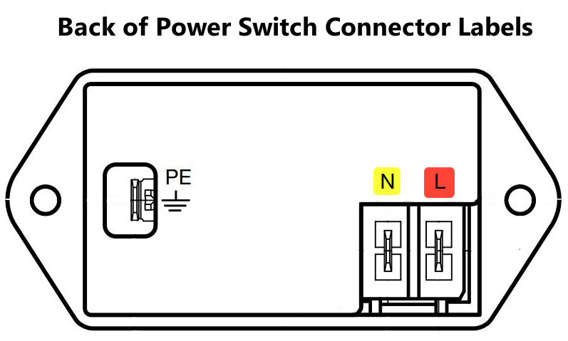
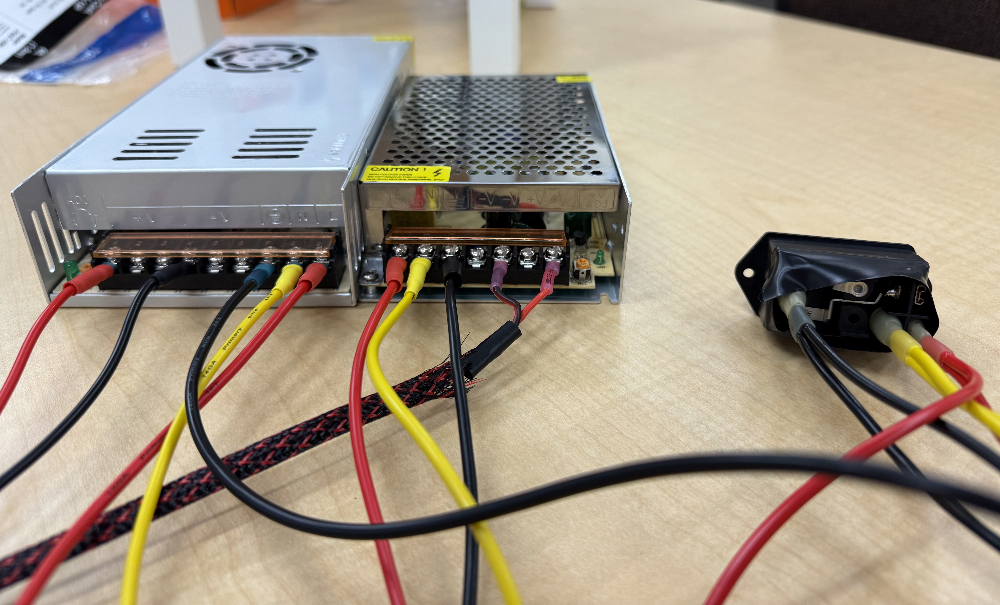

# Electronics Wiring and Control Board Setup

## Notes on Handling Electronics
electricity goes zappy

## Setting Up the Control Board
Before getting into initializing the robot setup, we'll begin by connecting power to the [motor control PCB](./Electrical-Assembly.md).

1. Connect the red fork of the 12V power cable (shorter cable with large connector) to the V+ label on the 12V power supply.
2. Connect the black fork for the 12V power cable to the V- label on the 12V power supply.
3. Connect the red fork of the 5V power cable (longer cable with small connector) to the V- label on the 5V power supply.
4. Connect the black fork of the 5V power cable to the V- label on the 5V power supply.
5. Connect red, yellow, and black cables to back of power switch.

   

6. Connect other ends to locations on both th 5V and 12V power supplies:
   - Red to L
   - Yellow to N (neutral)
   - Black to GND

   

7. Plug power cord to switch, then to a nearby power outlet.

Reference image:

   