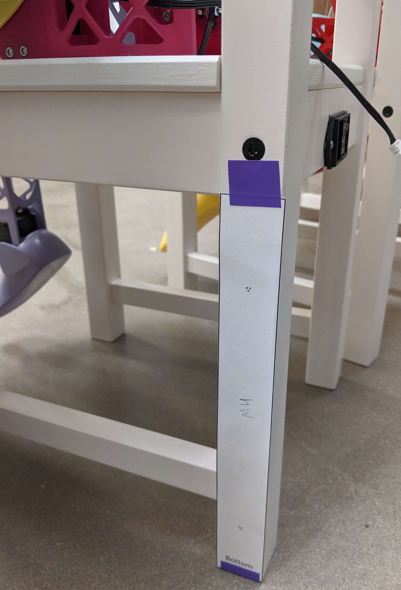
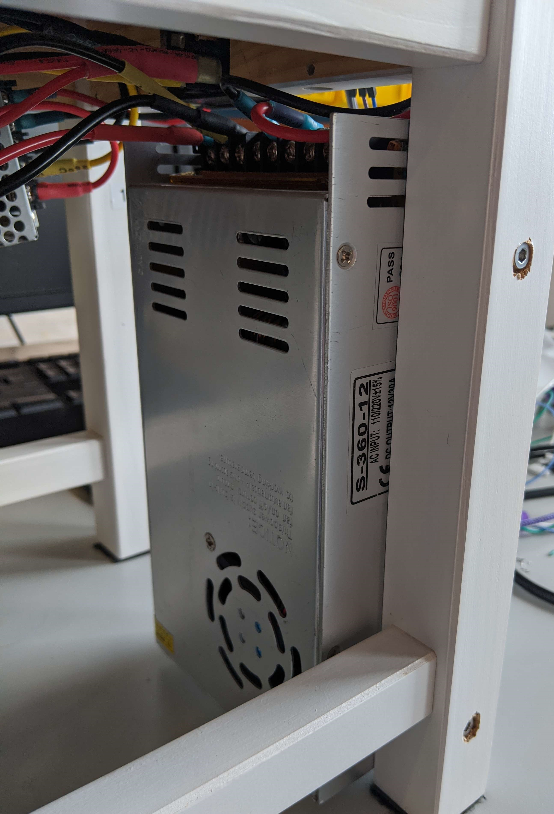
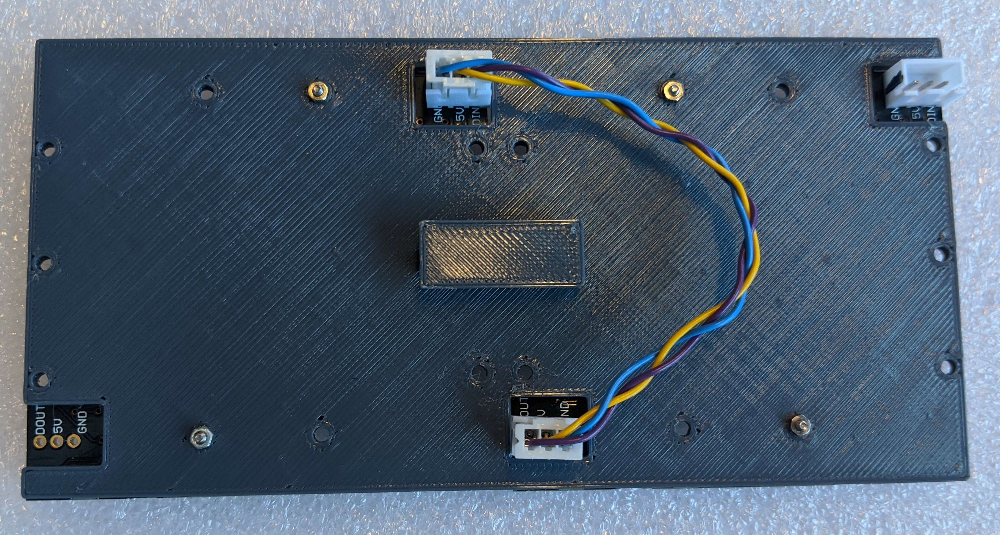

# Assembling all the Pieces

## Chair Modification and Assembly
The Ikea chair needs to be modified with screw and bolt holes to attach the robot, control PCB, two power supplies, and power switch.

Begin by first assembling the Ikea chair following their instructions.

### Power Switch

Requires:

 - Ikea chair
 - [Power switch]() and [fuse]()
 - M3x30 flathead screw x2 (Power switch screws)
 - M3 lock nut x2 (Power switch mounting)
 - [Power switch mounting template](res/chair_templates1.pdf)

1. Lay out the Power switch mounting template on the back of the plane of the chair below the seat.
2. Cut out the box in the dashed line, then fit the power switch into the cut out on the chair.

   

3. Drill holes through the wood using the screw holes in the switch as your location template.
4. Screw the two M3x30 flathead screws through the power switch holes and holes your drilled in chair
5. Lock down in place by tightening down the M3 lock nuts onto the end of the screws on the other side of the wood.

### 12V Supply Mounting

Requires:

 - Ikea chair
 - 12VDC Power Supply
 - M4x30 socket head screw x2 (12V to leg of chair)
 - [12V screw hole template](res/chair_templates1.pdf)

1. Lay out the 12V supply mounting template on the back leg of the chair, as shown in the image below.

   

2. Drill through the leg at the two marked holes with a bit sized for M4 screws.
3. Take a larger size drill bit, larger than the head of the socket head M4 screws and drill through from the outside just deep enough that the top of the M4 socket head would be flush with the chair.
4. Screw the M4 screws through the holes, and into the matching holes on the side of the 12V power supply, matching the orientation shown in the images below.

    

### 5V Supply Mounting

Requires:

 - Ikea chair
 - 5VDC Power Supply
 - M3x20 screw x2 (Side of chair for 5V)
 - M3x14 screw x2 (Bottom of chair for 5V)
 - [5V screw hole template](res/chair_templates1.pdf)

1. Fold the 5V supply mounting template along the center align.
2. Attach the template to the inside underside of the chair, as shown below.

   

3. Drill through the marked holes with a bit sized for M3 screws.
4. On the outside side of the chair and on top of the seat, drill part way in with a larger size drill bit to countersink the socket cap screw heads flush with the chair surface.
5. Screw the M3x20 screws through the holes in the side and into the matching holes on the back of the 5V supply, matching the orientation shown in the image below.

   

6. Screw the M3x14 screws through the holes in the seat of the chair and into the matching holes on the side of the 5V supply.

### Motor Control PCB Mounting

Requires:

 - Ikea chair
 - Motor control PCB assembly
 - M3x??+6 standoffs x4
 - [PCB mounting template]()

### Robot Mounting

Requires:

 - Ikea chair
 - SAMI Robot
 - M10x40 screw x2 (Robot attach to chair)
 - M10 washer x2
 - M10 lock nut x2
 - [Robot attachment template]()

## Final Assembly

### Eyes Assembly

Assembly of the eyes requires:

 - 8x8 NeoPixel array x2
 - Eye Panel 3D printed piece
 - M2.5 screws and nuts for eye panel
 - Short 3-pin JST cable
 - Long 3-pin JST cable

1. Take the first LED array and screw it into the flat side of the eye panel 3D printed piece, with the jst connectors pushed through the rectangular holes, and the DOUT labeled pin aligned to the rectangular hole closer to the center of the panel.
2. Screw the second LED array and screw it to the eye panel next to the first, with the DIN labeled data pin aligned closer to the center of the panel.
3. Attach the short 3-pin JST cable from the center-aligned DOUT connector of the first LED array to the center-aligned DIN connector of the second LED array.

   

4. Attach the long 3-pin JST cable to the DIN connector of the first LED array.

### Connect The Remaining Cables

For the two motors in the hips, the JST cables that come with the motors will need to be lengthened to reach the motor pcb. You'll need to splice in a 12" length of wire. This can be done by soldering, or with mechanical splice connectors such as [these](https://www.amazon.com/dp/B0DGLJJRZ5).

### Flash Arduino Code

1. Install FastLED from the Arduino Library Manager (version 3.9.12)
2. Install the [NeoEyes library](../Arduino/NeoEyes/) to your Arduino Library.
3. Flash the [SAMIMovementControl](../Arduino/SAMIMovementControl/) project to the Arduino MEGA2560 attached to the motor control board.

### Test Motor movements

Test movements for the motors using the software UI

