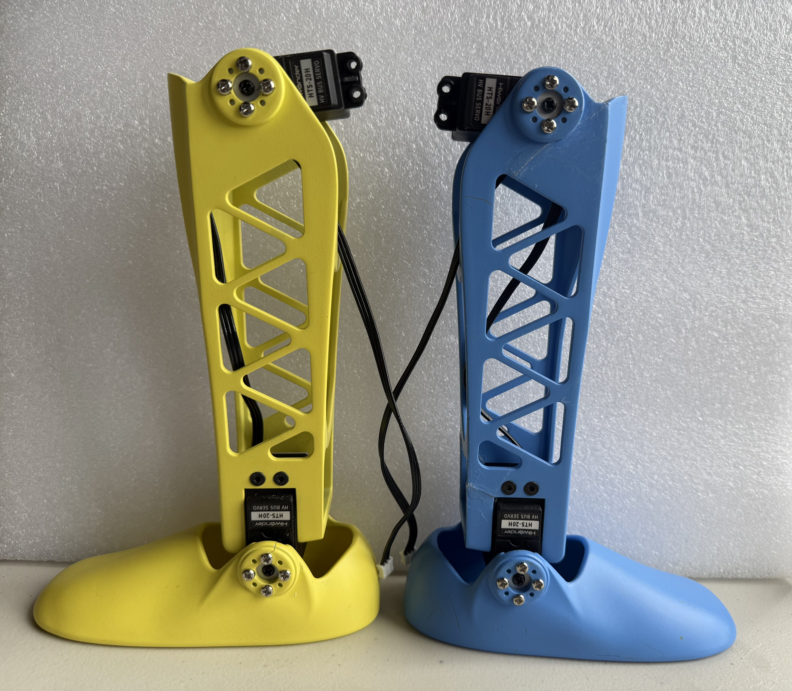
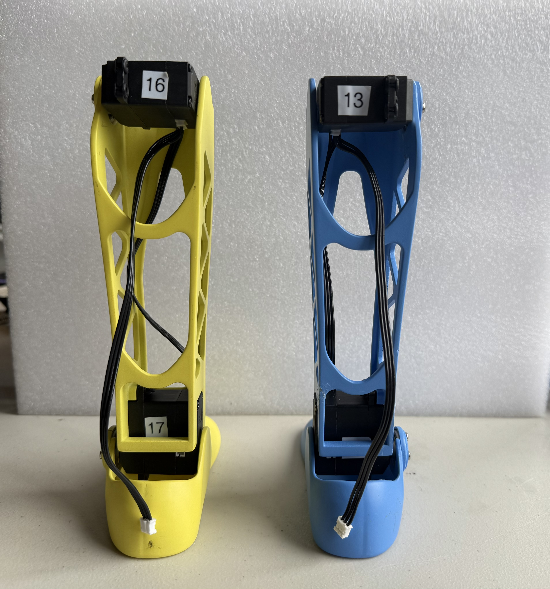
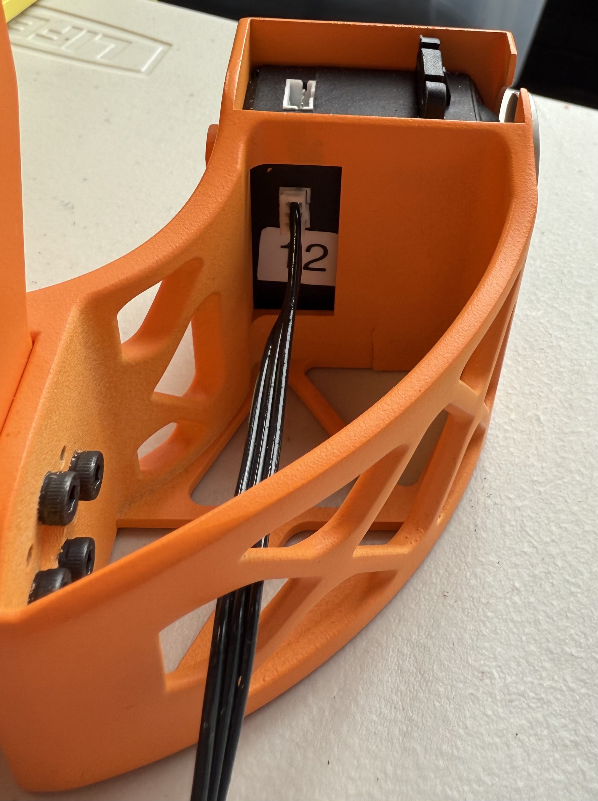
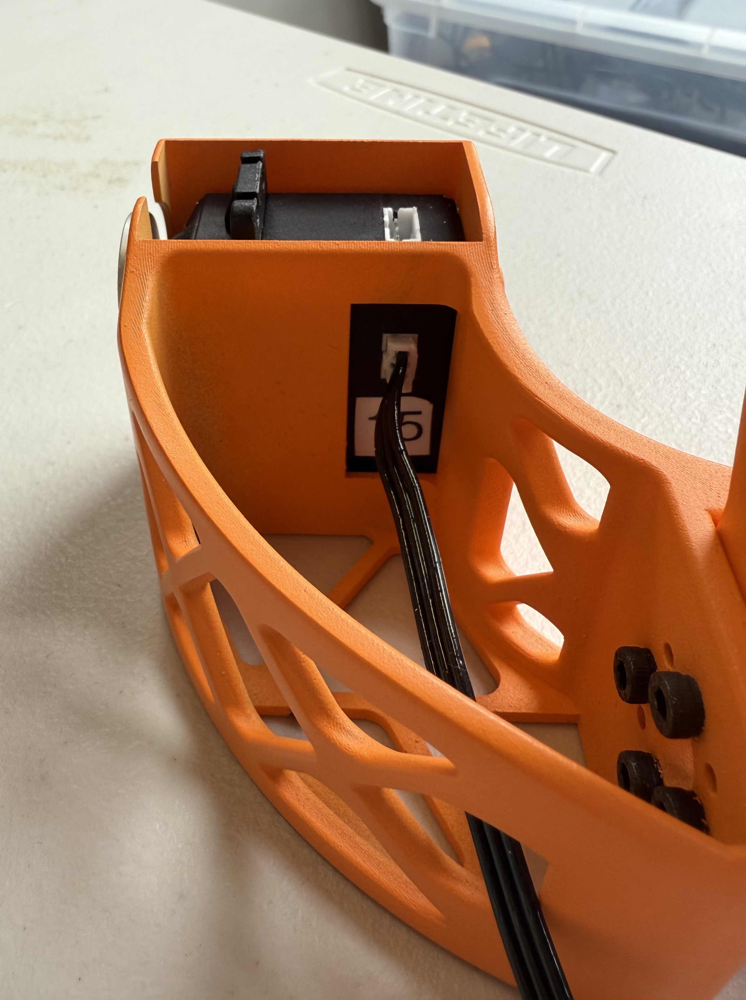
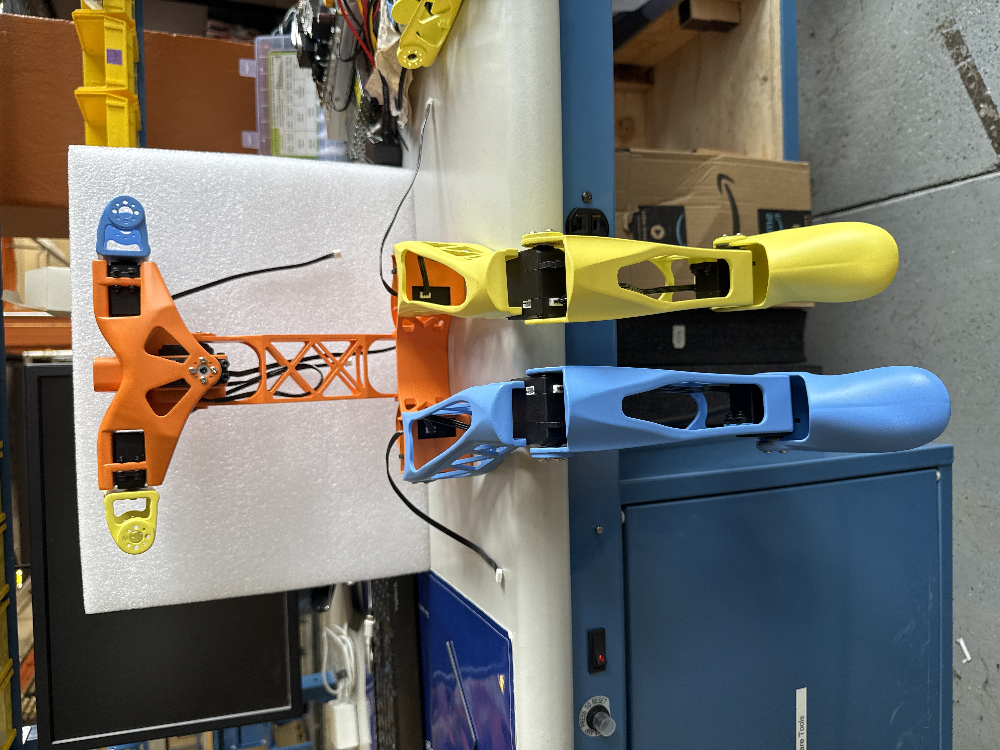

# Assembling the Lower Body
When assembling the lower body it is best to start with the feet and then work your way up to the upper legs. This ensures that you will have everything aligned and allows you to plug to corresponding JST cables as you go.

The first and foremost step that is **highly** recommended is pre-setting all of the Lower Body motors before beginning the assembly. 

The HiWonder HTS-20H servos involved in this assembly would be:
 - Right Hip
 - Right Knee
 - Right Ankle
 - Left Hip
 - Left Knee
 - Left Ankle
 
All correlated motor IDs are listed above in [Initializing Servo IDs and Positions](#initializing-servo-ids-and-positions), as well as instructions for how to set the IDs and their home positions. It is also recommended that you check the servo horn orientation during this time, following the alignment found in [Servo Horn Alignment](#servo-horn-alignment).

## Feet
Next up is the feet. The feet are a fairly quick and simple set-up that will require:
 - a M3 hex screwdriver
 - 8x silver servo M3 screws
 - 2x servo horns
 - 2x black rubber spacers from the motor package
 - 2x black M3 screws from the motor package
 - 2x JST cables
 - Motor ID 14
 - Motor ID 17
 
Pre-threading the plastic screw holes with the silver M3 screws before assembly. 
<!--Then attach the servos by aligning them upright to the sky. Add the rubber spacers onto the screw notches that will attach to the lower legs as this will help stabilize our screws in the frame (see figure below). Lastly, attach the JST cables into the space on the back of the servos. The final product should look like the figure below.-->

1. Attach servo horns onto motors 14 and 17 using 2 black M3 screws.
2. Insert motors upright into the Feet.
3. Secure motors with 8 silver M3 screws.
4. Attach JST cables onto back connection points of motors. 

Final product:

## Lower Legs
Following the set-up of the feet are the lower legs of the robot. Repeat these steps for both the right and left lower legs.

Each lower leg will require:
 - a M3 hex screwdriver
 - Knee Servo Motor
 - 2x black M3 screw from the motor package
 - 4x rubber spacers included in the motor package
 - 2x metal servo horn
 - 8x silver servo horn M3 screws
 - 4x tapered M3 x 18 mm screws
 - 4x M3 hex nuts
 - 2x JST cables
 - Motor ID 16
 - Motor ID 13

As done the same with the feet, pre-thread all the screw holes on the lower legs before beginning assembly. 
<!--Setting the lower legs in place on top of the ankle motors, begin screwing the legs in place using the tapered screws and hex nuts. We are now half-way through the step. The half-way product should look like the second figure below.-->

1. Attach lower legs to motors 14 and 17 using 4 tapered M3 x 18 mm screws.
2. Secure motors with 4 M3 hexagonal nuts.

Reference figures:

<!--Next, attach the Ankle JST cables to the bottom of the Knee motors, and a new JST cable onto the right side of the Left Knee motor. The Right Knee motor will have a new JST cable onto the left side. Finally, orient the Knee motors correctly onto the lower legs which should follow a 90 degree angle (the robot is sitting). Add rubber spacers onto the lower screw notches of the motor, where the upper legs will be attached.The figures below will show the final product, with JST cable, rubber spacer, and Knee motor orientation.--> 

3. Attach Ankle JST cables to bottom of motors 13 and 16, and new JST cables onto the sides. (Right side of motor 16, Left side of motor 13)
4. Orient motors 13 and 16 at ~90 degree angle on lower legs. Attach with 8 silver M3 screws.
5. Add rubber spacers onto upper notches of motors 13 and 16.

Final product:

## Upper Legs
Continuing now to the upper legs. The upper legs will require:
 - a hex screwdriver for tapered M3 screws
 - 4x tapered M3 x 18 mm screws
 - 4x M3 hex nuts
 
Following the similar process from the other limbs, pre-thread all the screw holes before beginning assembly. 
<!--Next, you can attach the lower end of the upper legs by attaching it to the motors on the upper part of the lower legs (using the tapered screws). Keep in mind that the JST cable for the Knee motors will need to run through the skeleton of the upper leg (see reference below). The final product should resemble the figure below.-->
1. Attach lower end of upper legs to motors 13 and 16 using 4 tapered M3 x 18 mm screws.
2. Secure motors with 4 M3 hexagonal nuts.

Final product, Left Leg:

Final product, Right Leg:

*Note that the cable path is incorrect in this figure, you should use the JST connection on the other side of the motor that will keep the JST cable from being pinched from ankle movement.*

## Hips
Finally, we reach the end of the Lower Body Assembly. The hips will require:
 - a M3 hex screwdriver
 - 2x metal servo horns
 - 8x silver servo horn M3 screws
 - 2x black M3 screws from the motor package
 - 4x rubber spacers from the motor package
 - 4x M3 x 25 mm hex screws
 - 4x M3 square nuts
 - 2x  extended JST cables
 - Motor ID 12
 - Motor ID 15
 
As usual, pre-thread all the screw holes, **especially**, where the motors are attached to the hips. 

1. Add rubber spacers onto the screw notches of the motor.
2. Place motor 12 on the right side of the hips. Press it down until the screw holes are aligned. See the figures below:

    
    
    
4. Use 2 M3 x 25 mm screws to begin securing the motor. Stop screwing the motors to leave space for the square nuts.
5. Insert 2 square nuts into the spaces located on the bottom of the hip. Tilt the piece to align the screws with the square nuts. Then fully screw in the motor.
6. Place motor 15 on the left side. Press it down until the screw holes are aligned. See the figure below:
   
    

7. Use 2 M3 x 30 mm screws to begin securing the motor. Stop screwing the motors to leave space for the square nuts.
8. Insert 2 square nuts into the spaces located on the bottom of the hip. Tilt the piece to align the screws with the square nuts. Then fully screw in the motor.

<!--Next, add the rubber spacers onto the screw notches of the motor (pictured below) and following comes the trickiest part of the Lower Body Assembly. Place the motors inside their corresponding slots in the hips (following correct orientation) and firmly press them down until you can see the rubber spacer peek out a little underneath. This does not mean you are trying your best to push the motor down so much that you damage material, but pressing it down enough that it stops moving and the screw holes are aligned. You can check this by screwing in one of the M3 x 30 mm screws and seeing if you feel a lot of resistance. There will exist some resistance (due to the spacers), but not enough that it feels like you will snap the hip upon using a hex screwdriver. 

After you have your motors settled with the screw holes aligned, make sure one of the screws is fitted far enough you can see it beginning to reach the square gap but not sitting in it at all (pictured below). Now, flip the 3D printed piece upside down so you are seeing the flat printed bottom. Insert a M3 square nut into one of the rectangular slots and align it with your incoming screw. **This step will take the most adjusting!** Try to continue screwing in the M3 x 25 mm into the piece and seeing if it captures the M3 square nut correctly. If it is meeting a lot of resistance or won't continue screwing, **retry**. Otherwise you might snap some material off. Tip: try tilting the hips at an angle if the M3 square nut is falling through too much, or if a bottom layer exists (usually from the 3D printing process), drop the nut from the top and fit it appropriately in its slot.-->

Following this step you can attach the servo horn onto the motor and JST cables protruding from the **back** connection of the Hip motors. The final product should look like the figure below:

Final product:

   
   

After, you can attach the lower limbs to the hip by screwing the Upper Legs into place on the Hips' servo horns (using the silver M3 screws). The final assembly should look like the figures below:

   

*In this figure, the JST cables connected to the Hips are wired incorrectly. You should use the back JST connection to attach your Hip cables. Also, your robot should only have the leg portion in this photo, ignore the additional components.*
