# Neck and Torso Assembly
When assembling the neck and torso for the robot, it is best to begin with the chest, then spine, and ending with the neck. Throughout this assembly you will need to attach the motors and JST cables onto certain pieces before moving on.

The first step that is **highly** recommended is pre-setting the IDs of all of the Neck and Torso motors before beginning the assembly. 

The HiWonder HTS-20H servos involved in this assembly would be: 
 - Right Chest motor
 - Left Chest motor
 - Head Nod motor
 - Head Tilt motor
 - Head Turn motor 

The two HiWonder HTS-35H servo are also part of this section of the assembly, and are used for the torso motors.
 - Torso Bow motor
 - Torso Tilt motor
 
All correlated motor IDs are listed above in [Initializing Servo IDs and Positions](#initializing-servo-ids-and-positions), as well as instructions for how to set the IDs and their home positions. It is also recommended that you check the servo horn orientation during this time, following the alignment found in [Servo Horn Alignment](#servo-horn-alignment).

## Chest Assembly
The chest will require:
 - A P1 philips screwdriver
 - A M2.5 allen key
 - 12x black rubber spacers from the motor package
 - 12x silver servo horn M3 screws
 - 3x JST cables
 - 12x M3 x 16 mm hex screws
 - 8x M3 hex nuts
 - 4x M3 square nuts
 - Motor ID 4
 - Motor ID 8
 - the Shoulder Connector pieces
 - the Chest piece

As recommended in the assembly notes, it is best to pre-thread the screw holes on the 3D printed parts. You should also have already Initialized the motor IDs and home positions with attached servo horns as described in the [initialization instructions](#initializing-servo-ids-and-positions)

Right Shoulder Chest
1. Insert the black rubber spacers into the screw slots for each of motor 4.
2. Insert motor 4 into the right shoulder slot on the chest piece. The servo should be oriented so the servo horn is closer to the back of the chest rather than the front as seen in the side photo below. Note the location of the dimple on the servo horn.

   
   
3. Use 4 of the M3x16 screws and 4 of the hex nuts to screw motor 4 to the chest.
4. Use 4 of the silver M3 screws to attach motor 4's servo horn to the righst side Shoulder Connector piece. It should be attached to the horn mount in the middle of the part, and the two sides of the part should be dipping "down" when attached as shown below. 

   
   
5. Attach the JST cable to the jst connector on the motor facing the back of the chest piece.

Left Shoulder Chest

6. Insert the black rubber spacers into the screw slots for each of motor 8
7. Insert motor 8 into the left shoulder slot on the chest piece. The servo should be oriented so the servo horn is closer to the back of the chest rather than the front.

   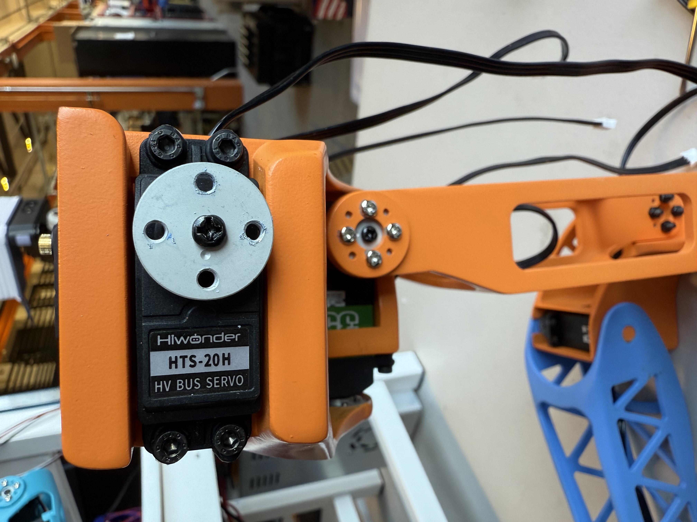

8. Use 4 of the M3x16 screws and 4 of the M3 hex nuts to screw motor 8 to the chest.
9. Use 4 of the silver M3 screws to attach motor 4's servo horn to the right side Shoulder Connector piece. It should be attached to the horn mount in the middle of the part, and the two sides of the part should be dipping "down" when attached as shown below.

   
   
10. Attach the JST cable to the JST connector on the motor facing the back of the chest piece.

With both motors installed and JST cables connected, the chest from behind should look like 

   
    

<!--The chest assembly will be fairly simple as you’ll be attaching the Right Chest, Left Chest, and Neck motors, then at the end, adding the Chest Connector piece that you just put together. The most difficult part of this assembly will be adding the Chest Connector piece onto the Chest.

For the Right and Left Chest motors add the black rubber spacers to all screw notches available, then attach them to their respective sides with the servo horn pins pointing away from the front of the chest. Next, use the M3 x 14 mm hex screws and hex nuts to attach the motors to the chest frame. After the motors have been attached, you can add JST cables to the connection points located on the back of the chest frame. The progress so far should look like the figures below:

Now, you can add the motors’ servo horns with the black M3 screws, then the Shoulder Connector pieces. You’ll want the orientation of the Shoulder Connector pieces to match the placement of the Chest motors. You can attach the Shoulder Connector pieces using the silver M3 screws. The final product should look like the figures below:

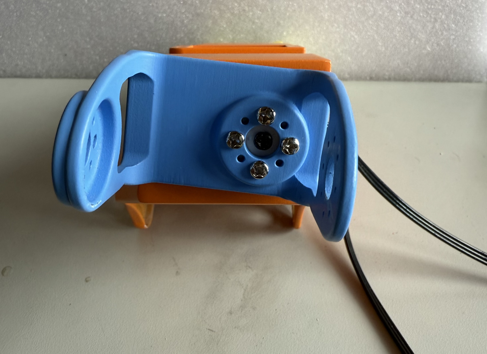-->

## Chest Connector Assembly
The Chest Connector assembly will require:
 - a M3 hex screwdriver
 - 8x rubber spacers from the motor packages
 - 2x black M3 screws from the motor packages
 - 8x square M3 nuts
 - 8x M3 x 16 mm hex screws
 - 2x servo horns
 - 8x servo horn M3 screws
 - 2x JST cables
 - Motor ID 19
 - Motor ID 18
 
As recommended with every step, it is best to pre-thread the screw holes on the 3D printed parts.

Chest Bow

1. Insert the black rubber spacers into all four of the screw slots on motor 19

   
**Use the connector on the right for Chest Assembly.**

2. Insert motor 19 into the slot that will *not* have another motor behind it. Make sure the servo horn and shaft are aligned to the plastic pin on the opposite side as shown in the image below.

   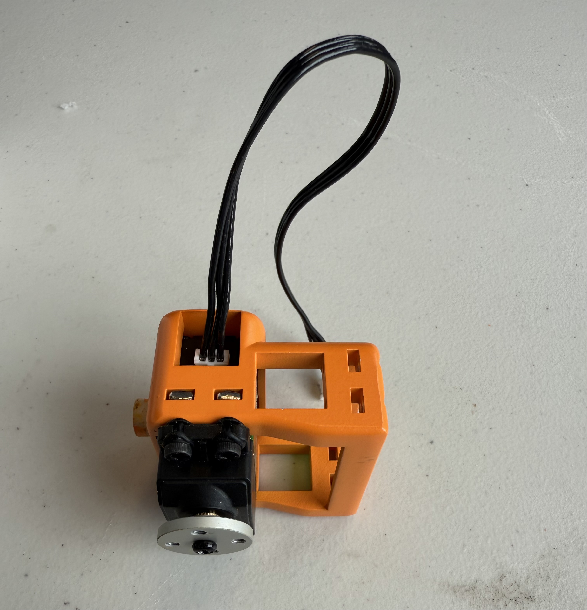 
   
3. Insert four of the M3 square nuts into the square nut slots around the motor and screw them down using the M3 x 16 mm screws.

Chest tilt

4. Insert the black rubber spacers into all four of the screw slots on motor 18
5. Insert motor 18 into the remaining motor slot, making sure the servo horn and shaft are aligned to the plastic pin on the opposite side as shown below.

   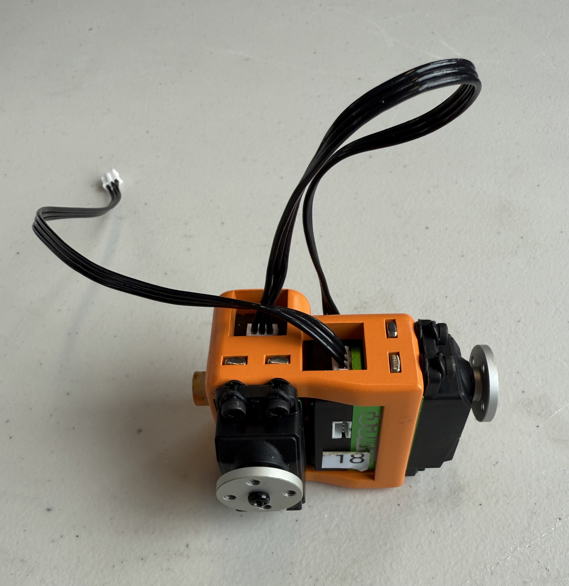 
   
6. Insert four of the M3 square nuts into the square nut slots around the motor and screw them down using the M3 x 16 mm screws.

Attaching to the Chest

7. Begin by slotting motor 18 into the chest upside down, with the servo horn facing the front plate, as shown below. *Do not screw in the servo horn yet.*

   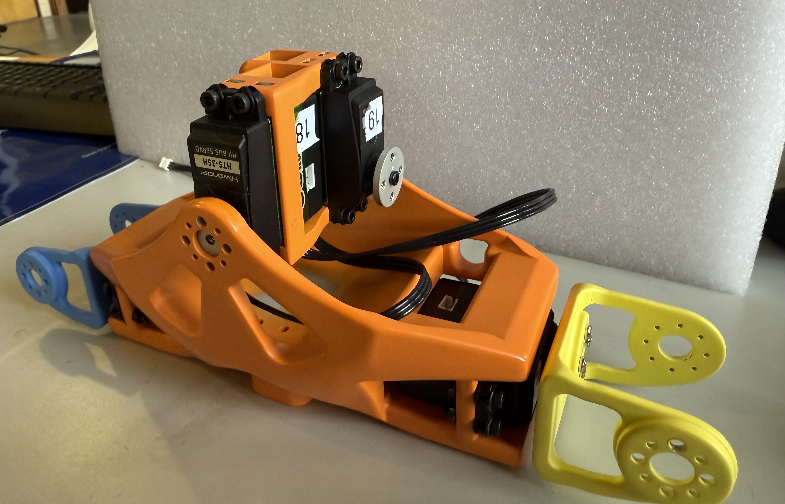
   
   
8. Rotate the chest connector assembly until it is right side up inside the chest, as shown below.

   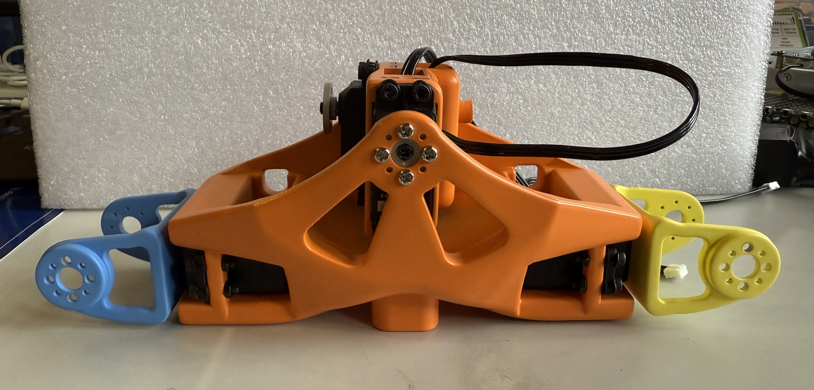
   
9. Attach the servo horn to the chest using four of the silver M3 motor screws.

<!--Begin by attaching the Chest Connector motors in the connector piece. Be aware of where you place certain motors as you’ll want your ID to match the movement that it will make on the robot. For example, Motor #18 will make a side-to-side movement while Motor #19 will be in charge of the up-down movement. 

The placement of these motors can be a little tricky, so a visual will be provided below to help orient them correctly along with the JST connections. A good rule of thumb for this connector piece is to have the motor shaft in-line with the pins located on the 3D printed piece. The figures below shows correct placement and JST cable paths:

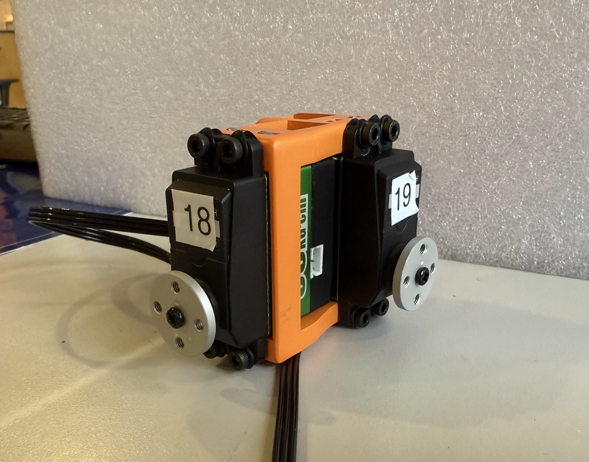

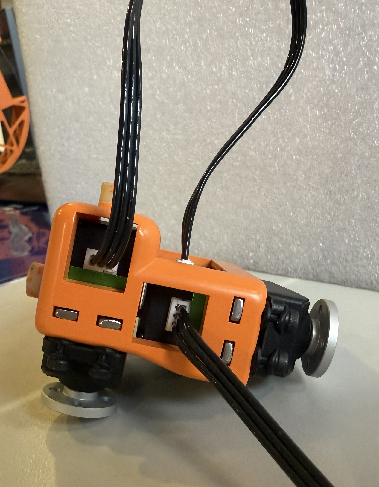

Now, add all the rubber spacers onto the screw notches of the motors and begin adding the screws until you barely reach the M3 square nut opening. Place the M3 square nuts in their corresponding spaces and continue tightening the screws completely. You might have to tilt the 3D printed piece a bit to keep the square nuts in their place.

After finishing the connector piece you can attach the servo horns using the black M3 screws. These servo horns will attach the piece to both the spine and the chest piece. Now begins the tricky part, attaching the Chest Connector to the chest piece.

To make this as simple as possible, begin by attaching the front motor (the one that will attach to the chest piece) first. You will want to attach this upside down to its placement, then rotate it into its correct position after fitting the Chest Connector in correctly. A correct placement means that both the servo horn and the pin (on the back of the chest piece) are both slotted into their designed positions. The figures below show the assembly process and final product:

-->

## Spine Assembly
The Spine assembly will require:
 - a M3 hex screwdriver
 - 4x silver servo horn M3 screws from the motor package
 - 8x hex nuts
 - 8x M3 x 14 mm hex screws

As recommended with every step, it is best to pre-thread the screw holes on the 3D printed parts.

<!--To begin assembling, attach the frame of the spine to the hips. It is important that you attach the spine by the screw attachments that don’t include the servo horn location. It is also recommended that you screw in the spine with four screws in a diamond shape (the only screw holes that M3 screws will fit). This will give you a stable base for you to attach the rest of the torso on. This step should not impede instructions provided later for the Lower Body Assembly.-->

1. Attach bottom frame of spine to hips using 4 M3 x 14 mm screws and 4 hex nuts. Screw in diamond shape.

The figure below shows screw placement:

   
   

Following the attachment to the hips is attaching the Chest Assembly to the Spine. 
<!--There should be a servo horn left on the Chest Connector that is orientated in the same direction as the available horn slot on the Spine. Attach the Chest to the Spine using this connection point with the silver M3 screws.-->
The final product should look like the figures below:

2. Slot the spine over motor 19, with the servo horn over the bulge, and the flat plane of the spine aligned with the back of the chest piece. The figure below is only meant to show correct orientation.

   
   
3. Screw in motor 19 by attaching four silver M3 motor screws to the servo horn through the holes in the spine.

Final product: 

   
   
   

## Neck Assembly
The neck will require:
 - a M3 hex screwdriver
 - 1 servo horn
 - 1 black M3 screw from the motor package
 - 4x black rubber spacers from the motor package
 - 4x silver servo horn M3 screws
 - 1 JST cable
 - 4x M3 x 16 mm hex screws
 - 4x M3 square nuts
 - Motor ID 3

As recommended with every step, it is best to pre-thread the screw holes on the 3D printed parts.

<!--First, add the black rubber spacers to all screw notches of the Neck motor. Next, you’ll want to add 4 square nuts to the spaces available on the empty motor space on the top of the chest piece. Using the M3 x 16 mm screws, attach the Neck motor. Next, add a servo horn using the silver M3 screws to the placement located on the bottom of the Neck piece. It will be easier to add the servo horn to the piece first than attaching it to the motor. After attaching the servo horn onto the Neck piece, you can add the Neck piece onto the Neck motor and secure it with a black M3 screw.

At this step you can also add a JST Cable to the port opening located on the back of the chest frame. The final product should look like the figures below:-->
1. Insert the black rubber spacers into the screw slots for each of motor 3
2. Insert 2 of the M3 square nuts into the slots in on the inside of the neck of the chest piece, as shown below.

    
    
3. Insert motor 3 into the neck of the chest piece. The servo should be oriented so the servo horn is closer to the back of the chest rather than the front.
4. Insert the remaining 2 M3 square nuts into the slots on the back of the neck of the chest piece.
5. Use the remaining 4 M3x16 hex screws to screw down motor 3 to the chest, making sure to screw into the square nuts.
   
   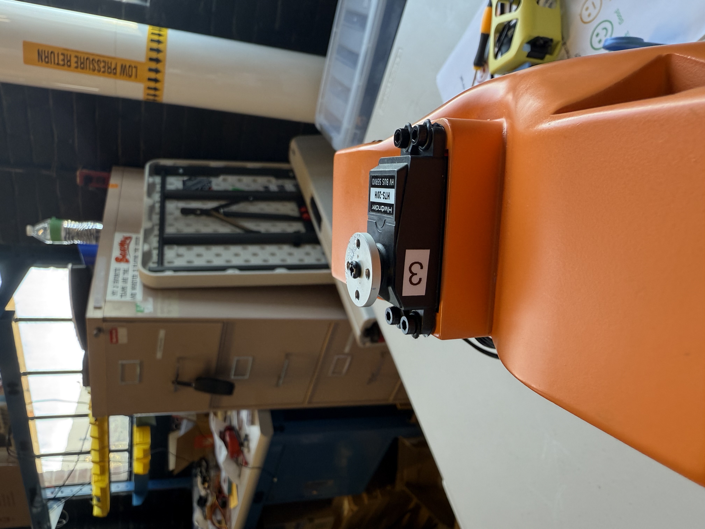
   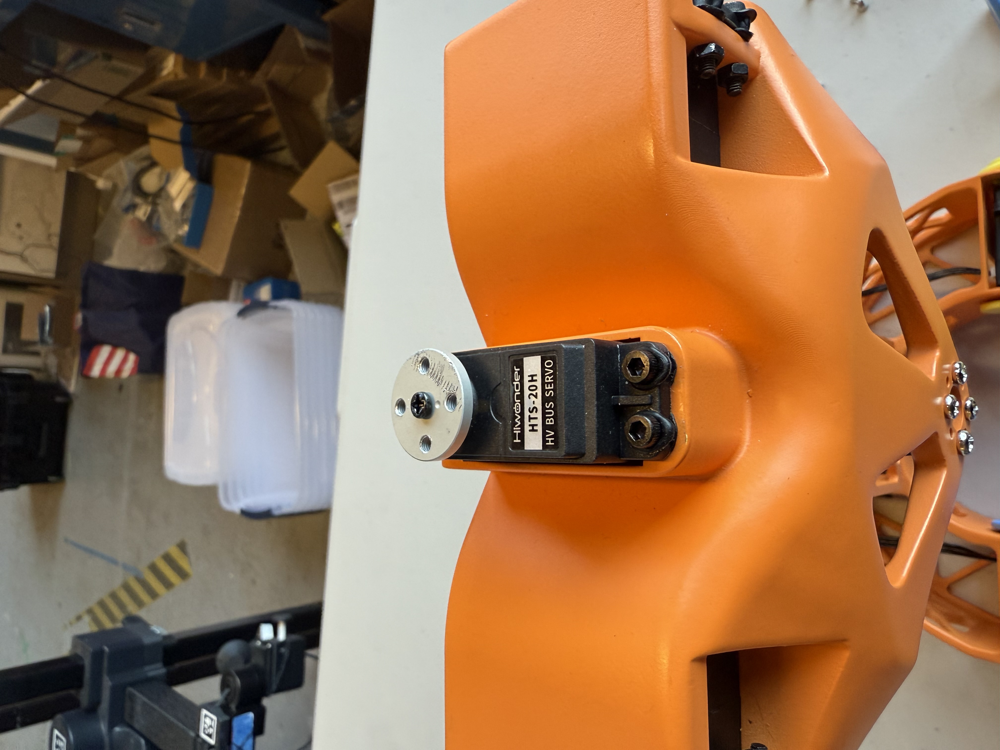

6. Attach the neck piece to the servo horn with 4 silver M3 screws, matching the orientation shown below.

   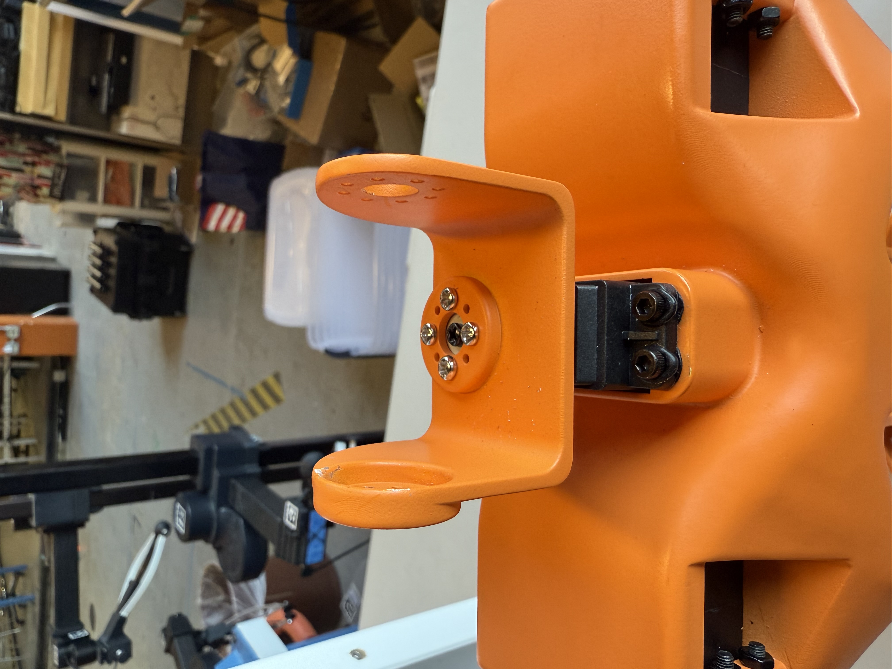
   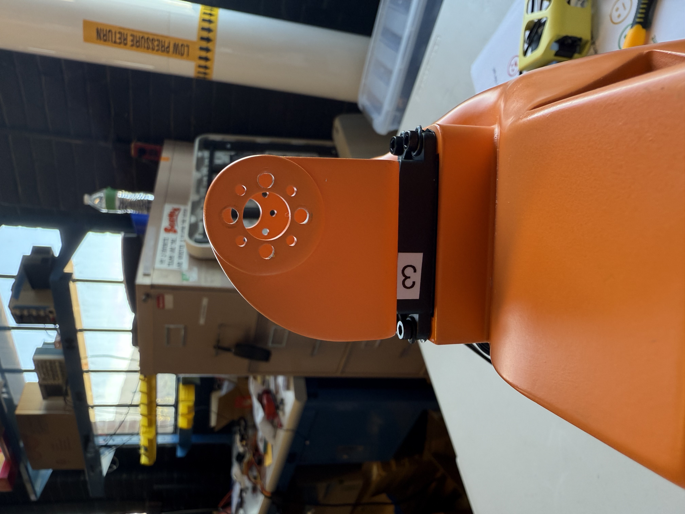
    
7. Attach the JST cable to the jst connector on the motor facing the back of the chest piece.

## Neck Connector Assembly
The Neck Connector will require:
 - a M3 hex screwdriver
 - 2x servo horns
 - 8x servo horn M3 screws
 - 2x black M3 screws from the motor packages
 - 8x black rubber spacers from the motor packages
 - 3x JST cables
 - 8x M3 x 16 mm hex screws
 - 8x square nuts
 - Motor ID 2
 - Motor ID 1

As recommended with every step, it is best to pre-thread the screw holes on the 3D printed parts.

<!--Begin by adding the rubber spacers to all screw notches on your Neck Connector motors, then you can begin attaching the motors in the connector piece using the M3 x 16 mm screws. Be aware of where you place certain motors as you’ll want your ID to match the movement that it will make on the robot. For example, Motor #1 will make a side-to-side movement while Motor #2 will be in charge of the up-down movement. After adding the motors you can attach their servo horns using the black M3 screws.

The placement of these motors can be a little tricky, so a visual will be provided below to help orient them correctly along with the JST connections. A good rule of thumb for this connector piece is to have the motor shaft in-line with the pins located on the 3D printed piece. The figures below shows correct orientation and JST cable paths:-->

Neck Bow

1. Insert the black rubber spacers into all four of the screw slots on motor 2

   
**Use the connector on the left for Neck Assembly.**

2. Insert motor 2 into the slot that will *not* have another motor behind it. Make sure the servo horn and shaft are aligned to the plastic pin on the opposite side as shown in the image below.

   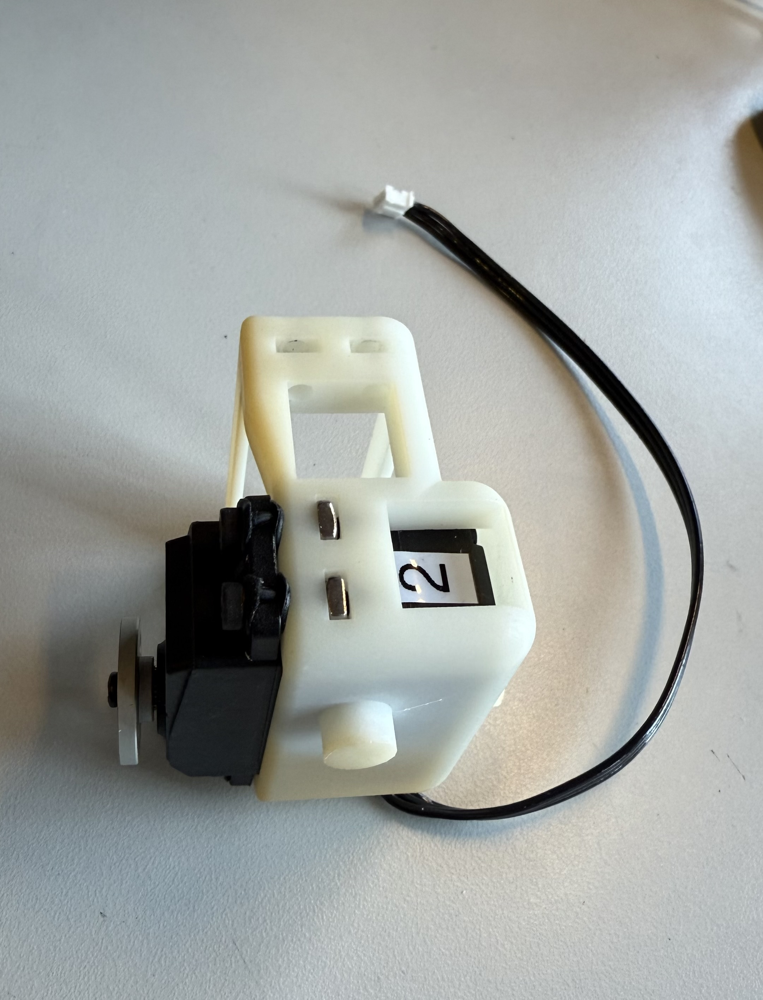
   
3. Insert four of the M3 square nuts into the square nut slots around the motor and screw them down using the M3 x 16 mm screws.
4. Attach a JST cable to bottom connection point of motor 2.

Neck Tilt

5. Insert the black rubber spacers into all four of the screw slots on motor 1
6. Insert motor 1 into the remaining motor slot, making sure the servo horn and shaft are aligned to the plastic pin on the opposite side as shown below.

   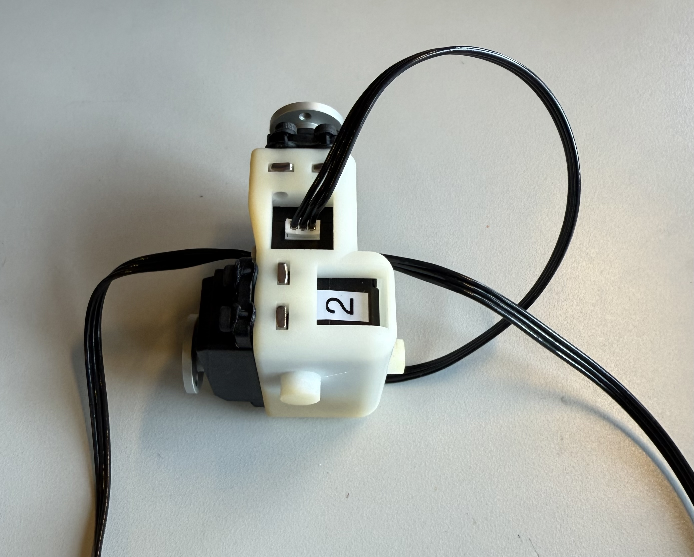
   
7. Insert four of the M3 square nuts into the square nut slots around the motor and screw them down using the M3 x 16 mm screws.
8. Attach JST cable from motor 2 to top connection point of motor 1.
9. Attach additional JST cables to both sides of motor 1.

<!--
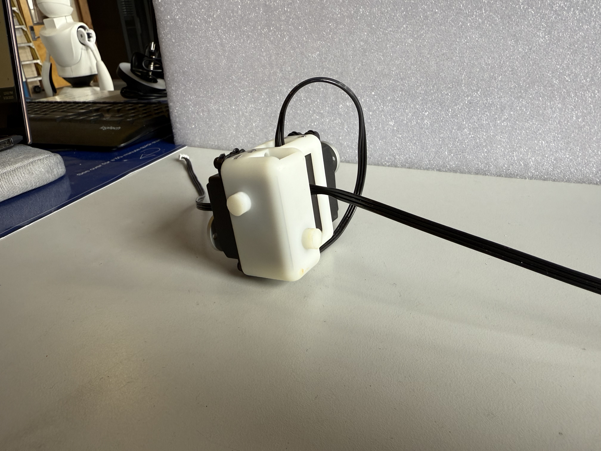
-->

## Head Assembly
The Head Assembly will require:
 - a M3 hex screwdriver
 - 8x silver servo horn M3 screws from the motor package
 - 2x M3 x 20 mm screws
 - 2x M3 square nuts 

As recommended with every step, it is best to pre-thread the screw holes on the 3D printed parts.

<!--You will first want to attach the Neck Connector piece to the Neck piece that should be attached to the Chest piece at this point. Motor #1 should be attached to the servo horn placement on the Neck piece, and secured with the silver M3 screws. Next, you’ll want to use the piece that looks like U (this piece will help us attach the headshell later) and attach it to Motor #2 located on the Neck Connector piece.--> 
1. Attach Neck Connector to motor 1 and secure with 4 silver M3 screws. Follow images below for correct orientation.
2. Attach U-shaped piece to motor 2 using 4 silver M3 screws.

   
   

<!--Next, insert the square nuts into the square slots on the U-shaped piece. Be sure to use a tool to push them as far in as they can go. You can check if they are in the right place by peering through the screw hole to see if the holes line up. See the figure below for a clearer visual (at this step the LED panel can be added, but optional):-->
3. Insert 2 square nuts into the slots on U-shaped piece. Use a small tool to push them as far in as they can go. LED panel can also be added at this step (press-fit attachment).

   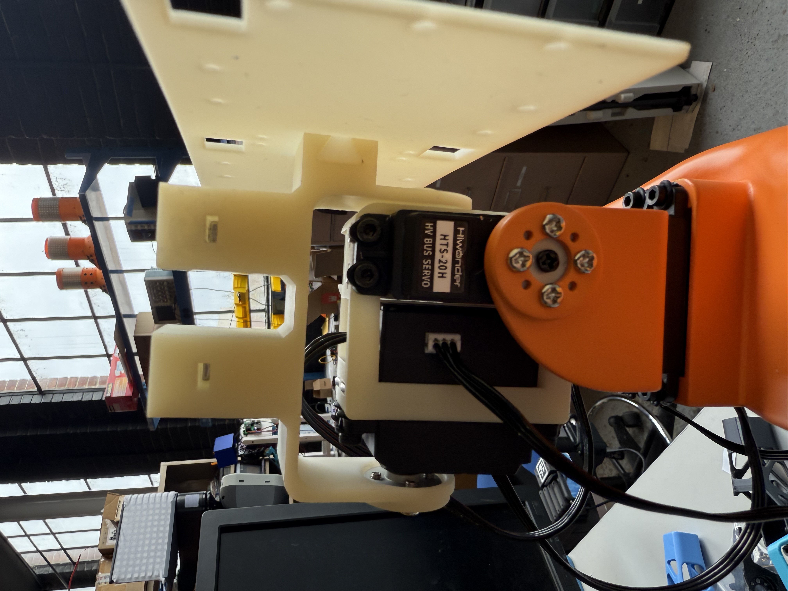

<!--After, you can place the headshell on top of this U-shaped piece by aligning the cylinder extrusions of the headshell with the cylinder-shaped gaps on the U piece. The two should fit snug and you should be able to press the headshell down to secure the fit. You can then complete the headshell’s attachment by screwing in the M3 x 20 mm screws until they reach past the square nuts. The final product should look like the figures below:-->
4. Place headshell on top of U-shaped piece by aligning cylinder shaped press-fits.
5. Secure in headshell with 2 M3 x 20 mm screws.

   
   
