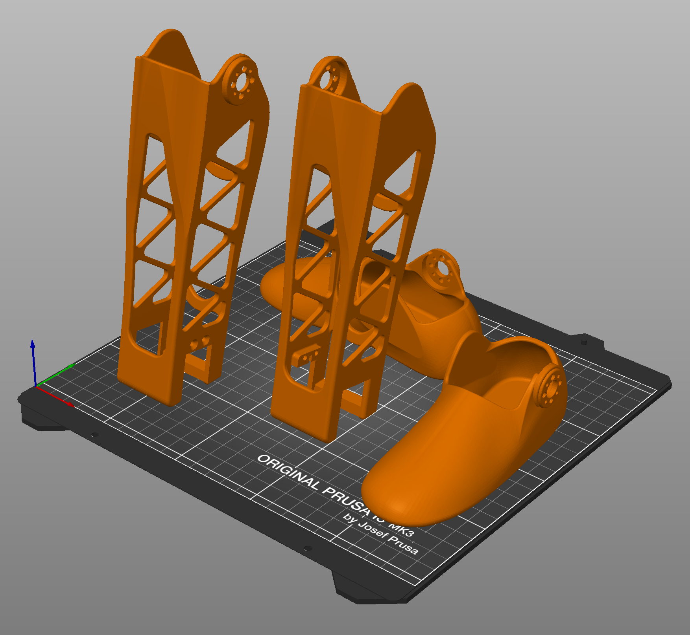

# Sub-Assembly Fabrication for the Robot

## 3D Printing & Orientations
*If using Prusa i3 printers with Prusa Slicer,* all parts should be printed at 0.3mm resolution ("draft quality" on Prusa Slicer), with 15% gyroid infill, and organic supports enabled (where necessary), **except for the chest piece,** which should be printed at 0.2mm resolution, with 15% gyroid infill, and normal grid-style supports instead. Alternatively, the **finger hinges** should be printed using PETG filament with 0% gyroid infill and a brim.

**The hands** used for this robot have been sized down by 42.5% with minimal changes to the bolt holes from the [original prosthetic model](), but the mechanism funtionality remains the same.

Print orientations are shown below for each part, along with the part names that are used throughout this documentation.

### Headshell

### Chest and Headshell Panel

### Head/Neck Connectors and Spine

### Shoulders and Upper Arms

### Hands and Lower Arms

### Finger Hinges

### Hips and Upper Legs

### Lower Legs and Feet
   