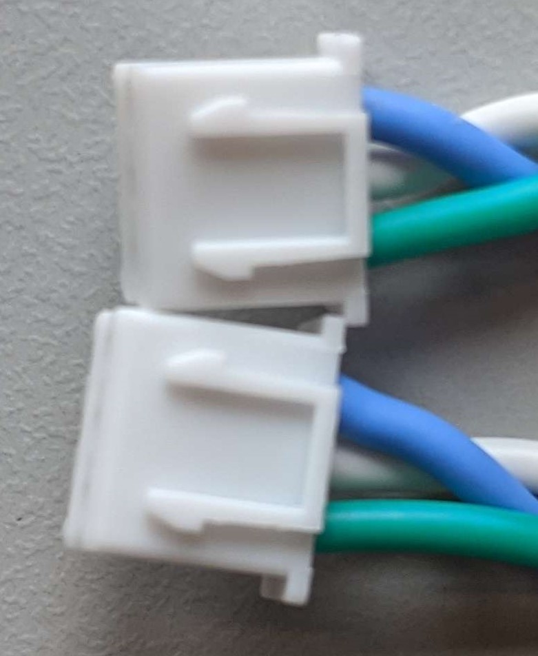
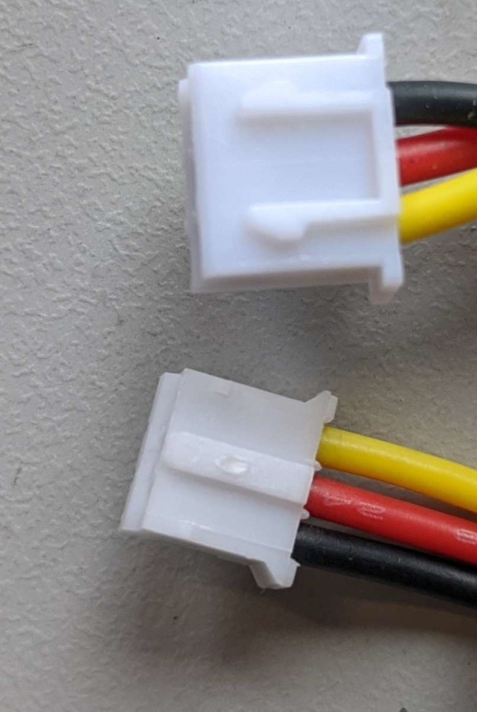

# Aaron Robot Electrical
All of the information for the electrical systems and wiring for the robot.

## Future Improvements
TODO:
 - So much assembly

## Cable Fabrication
There are three power cables that need to be assembled to supply power to the robot. The components and assembly instructions for each are provided below.

For the fork connectors we used [14-16 gauge, #8 fork connectors with heat shrink attached, from wirefy](https://www.amazon.com/dp/B07YBHDBST) and for the spade connectors, we used [10-12 guage, female quick disconnect spade connectors with heat shrink, also from wirefy](https://www.amazon.com/dp/B08BP57G94).

### 12V PCB to Power Supply
This cable assembly connects the 12V power on the motor control PCB to the 12V power supply for the robot.

#### Materials
 - 1x red 14AWG braided wire, 18" length minimum
 - 2x red heat shrink pieces
 - 1x black 14AWG braided wire, 18" length minimum
 - 2x black heat shrink pieces
 - 1x XT-60 female plug
 - 2x fork connector #8, 16-14 gauge opening

#### Assembly
For connecting the wires to the XT-60 connector, you may follow [this](https://www.youtube.com/watch?v=eeDYUymM3XI) short video tutorial.

### 5V PCB to Power Supply
This cable assembly connects the 5V power on the motor control PCB to the 5V power supply for the robot.

#### Materials
 - 1x red 18AWG braided wire, 24" length minimum
 - 2x red heat shrink pieces
 - 1x black 18AWG braided wire, 24" length minimum
 - 2x black heat shrink pieces
 - 1x XT-30 female plug
 - 2x fork connector #8, 22-16 gauge opening

#### Assembly

### 12V Power Supply to Outlet to 5V Power Supply
This cable assembly connects both the 12V power supply and 5V power supply to the power outlet on the back of the chair that takes 120VAC wall power. The 12V supply and 5V supply are at different locations and could use different cable lengths, but for ease of assembly, we use the same lengths of wire for both of them.

#### Materials
 - 2x red 14AWG braided wire, 12" length minimum
 - 3x red heat shrink pieces
 - 2x black 14AWG braided wire, 12" length minimum
 - 3x black heat shrink pieces
 - 2x yellow 14AWG braided wire, 12" length minimum
 - 3x yellow heat shrink pieces
 - 6x fork connector #8, 16-14 gauge opening
 - 3x female spade connector, 12-10 gauge opening

#### Assembly

### Hip Motor to Control PCB JST Cable
For the two motors in the hips, the JST cables that come with the motors will need to be lengthened to reach the motor pcb. You'll need to splice in a 12" length of wire. This can be done by soldering, or with mechanical splice connectors such as [these](https://www.amazon.com/dp/B0DGLJJRZ5).

You will need:
 - 1x 3 pin JST cable (comes with motor)
 - 1x 3 wire cable, 12" length minimum
 - Solder and heat shrink or [2x mechanical crimp splicers](https://www.amazon.com/dp/B0DGLJJRZ5).

Split the JST cable that comes with the motor down the middle. Then splice in the 12" length of cable, such that the connector ends match each other (*not* mirrored!) See the photo below.

### Eye Panel Short Cable
This is the short cable combining the two LED array panels for the eyes.

You will need:
 - 2x 3pin JST XH2.54 connectors
 - 1x 3 wire cable, 4" length (try not to go long)

Assemble the connectors to the cable such that the connectors match each other (*not* mirrored!). See the photo below.

### Eye Panel Long Cable
This is the logn cable connecting the first LED array panel to the motor control board. 

You will need:
 - 1x 3pin JST XH2.54 connector
 - 1x 3pin JST PH2.0 connector
 - 1x 3 wire cable, 16" length minimum

Assemble the cable so that wires connect into the connectors as shown in the image below.

### Gripper Cable
The cable to connector the gripper servo motors to the motor control pcb. It converts a dupont connector to a JST PH2.0.

You will need:
 - 1x 3pin JST PH2.0 connector
 - 1x 3pin Dupont female connector
 - 1x 3 wire cable, ?? length minimum

Connect the dupont to the jst as shown below, where white is the signal line, red is power, and black is ground. 

## Bill of Materials
Currently all in the excel doc one level up

 - Power Supply: 12V, 30A, buck converter down to 6V (Need to check current still)
 - PTC Fuses for each motor: RKEF075-2
 - Relays for each motor group: PR9-5V-200-1A
 - NPN Transistors for each motor group relay controller: BC547CBU-ND
 - Diode between motors and servo: 15SQ100

## Wiring Guide

## Custom PCBs

### Safety Circuitry

#### Motor Current Characteristics

See the motor current characteristics for the arms (without gripper) and legs below. The measured torso nod motor current during operation was seen as a maximum of 0.6A, and the stall current was measured at 1.12A. The measured torso tilt current during operation similarly hit a maximum of 0.6A, but the stall current when held still was 1.99A.

#### Safety Circuit Current Breakdown
We have PTC fuses to protect the servos from melting themselves, and 15A relays so we can cut power to the servos if operation is not currently necessary.

##### Relay Circuits
There are 6 relay groups, broken down for each arm, and leg, as well as the neck and torso. Each relay needs 40mA control current, which becomes 240mA current from the Arduino 5V line. To turn the control circuit on and off, each relay has an individual NPN transistor. These transistors are controlled by a common Arduino pin.

 - Arm Motors: Max Rating: 12.5A, 75W @ 6VDC
    - Chest Shoulder
    - Shoulder
    - Arm Twist
    - Elbow
    - Single Tendon Gripper
 - Leg Motors: Max Rating: 7.5A, 45W @ 6VDC
    - Hip
    - Knee
    - Ankle
    - Hip flexor motor? (add another 2.5A)
 - Head Motors: Max Rating: 7.5A, 45W @ 6VDC
    - Head Twist
    - Head Nod
    - Head Tilt
    - Camera pan motor? (add another 2.5A)
 - Torso Motors: Max Rating: ~6A, 45W @ 7.4VDC
    - Torso Tilt
    - Torso Bow
    - Spine-hip bow point? (adds another ~3A)

## References
 - [Flyback diode example circuit](https://blog.mbedded.ninja/electronics/components/relays/)