# Social Animated Mechanical Interlocutor (SAMI) Robot Hardware
All of the hardware information for the robot system.

 1. [Bill of Materials (BoM)](#bill-of-materials-bom)
 2. [Assembly Instructions](#assembly-instructions)
 3. [Mechanical Information](#mechanical-information)
 4. [Electrical Information](#electrical-information)

## Bill of Materials (BoM)
The below mechanical and electrical BoMs include all components that are assembled into the robot system, and are the minimum hardware requirements necessary to make the system. In addition to this, it is assumed you have a computer to run the higher level system control, with one USB port as a minimum, with an additional USB port for the sensor box, and an HDMI port for the captioning system.

In addition to the above components, as part of the assembly process, it is assumed you have access to standard electrical prototyping equipment such as breadboards and jumper wires, as well as a benchtop power supply or other 12V power source for use during robot assembly.

### Mechanical Bill of Materials
The mechanical BoM includes all of the 3D printed parts, and associated screw pieces (currently in an excel doc for my sanity)

#### Robot 
3D printed so many parts
 - M3 square nuts: 
 - M3 hex nuts: 20
 - M3 lock nuts: 20
 - M3 servo horn screws: 86
 - M3x14 socket cap hex bolts: 8
 - M3x16 socket cap hex bolts: 32
 - M3x20 socket cap hex bolts: 6
 - M3x25 socket cap hex bolts: 4
 - M3x18 flat head countersunk hex bolts: 12
 - Metal servo horns: 19

so, so many screws
Ikea chair
cable ties
diffusion acrylic (optix is what we used)
fishing line (check thickness) and eyelets (for tendon gripper)

#### Sensor Box
3D printer enclosure
3D printed button tops
3D printer button covers
some screws

#### Captioning System
3D printed enclosure
some screws probably

### Electrical Bill of Materials
The electric BoM includes all components necessary for populating all PCBs and sensors, as well as initial assembly. It's currently in an excel doc along with the mechanical bom

#### Robot 
17x HiWonder HTS-20H servos
2x HiWonder HTS-35H servos
2x linear actuator
so much pcb electronics
jst connector cables for the servos
arduino mega 256?
2x adafruit led 8x8 panels
12V power supply
power switch
5V power supply?
more bits idk
usb cable
panel mount usb cable?

##### Optional bits to mount in the robot space:
speakers
microphone
webcam

#### Sensor Box
2x PIR sensor
1x ultrasonic sensor
1x arduino
2x button
rfid thing
more bits
usb cable
panel mount usb cable

#### Captioning System
7" portable monitor (with dimensions matching [this one](https://www.amazon.com/dp/B09MFNLRQQ))
HDMI cable (probably comes with)
usb power cable (probably comes with)

## Assembly Instructions
 1. [Robot Assembly Instructions](#robot-fabrication-and-assembly-instructions)
     1. [3D Printing & Orientations](#3d-printing--orientations)
     2. [Initializing Servo IDs and Positions](#initializing-servo-ids-and-positions)
     3. [Overall Assembly Information]()
     4. [Neck and Torso Assembly](#neck-and-torso-assembly)
     5. [Arm Assembly](#arm-assembly)
     6. [Lower Body Assembly](#lower-body-assembly)
     7. [Final Assembly](#final-assembly)
 2. [Sensor Box Assembly Instructions]()
 3. [Caption Assembly Instructions]()

### Robot Fabrication and Assembly Instructions
This section describes the part fabrication and hardware assembly process for the actual robot.

#### 3D Printing & Orientations
*If using Prusa i3 printers with Prusa Slicer,* all parts should be printed at 0.3mm resolution ("draft quality" on Prusa Slicer), with 15% gyroid infill, and organic supports enabled (where necessary), **except for the chest piece,** which should be printed at 0.2mm resolution, with 15% gyroid infill, and normal grid-style supports instead. Alternatively, the **finger hinges** should be printed using PETG filament with 0% gyroid infill and a brim.

**The hands** used for this robot have been sized down by 42.5% with minimal changes to the bolt holes from the [original prosthetic model](), but the mechanism funtionality remains the same.

Print orientations are shown below for each part, along with the part names that are used throughout this documentation.

##### Headshell

##### Chest and Headshell Panel

##### Head/Neck Connectors and Spine

##### Shoulders and Upper Arms

##### Hands and Lower Arms

##### Finger Hinges

##### Hips and Upper Legs

##### Lower Legs and Feet

#### Initializing Servo IDs and Positions
You will need to communicate with the motors as part of the assembly process. This process can be completed using the completed robot PCB, or the [HiWonder motor debugging board]().

In either case, you will be initializing each motor by connecting and communicating with it individually (*not* chaining the motors). The below initialization instructions assume you are initializing the motors using the robot motor control PCB.

Before assembling the robot, it is necessary to assign unique motor IDs for each joint motor. You can set these IDs with the [SetServoID Arduino code project](../Arduino/SetServoID/) using the motor control PCB for the robot. Any ID numbers may be chosen, but the default configuration file, and these assembly instructions, will use the joint names and IDs as listed in the table below.

|     Joint Name       | ID | Assembly Orientation |
|----------------------|----| -------------------- |
| Head Tilt            | 01 |  |
| Head Nod             | 02 |  |
| Head Turn            | 03 |  |
| Right Shoulder Pitch | 04 |  |
| Right Shoulder Roll  | 05 |  |
| Right Arm Twist      | 06 |  |
| Right Elbow          | 07 |  |
| Left Shoulder Pitch  | 08 |  |
| Left Shoulder Roll   | 09 |  |
| Left Arm Twist       | 10 |  |
| Left Elbow           | 11 |  |
| Right Hip            | 12 |  |
| Right Knee           | 13 |  |
| Right Ankle          | 14 |  |
| Left Hip             | 15 |  |
| Left Knee            | 16 |  |
| Left Ankle           | 17 |  |
| Torso Bow            | 18 |  |
| Torso Tilt           | 19 |  |
| Right Gripper        | 20 |  |
| Left Gripper         | 21 |  |

During assembly of the robot, it will be necessary to set each motor to a known rotation and then assemble the parts to match that orientation. These positions are *not operational home*, but are instead an easy reference position for use in assembly. The robot assembly pose, along with each joint name, motor ID, and the motor angle corresponding to the current pose, are shown in the image below. 

**IMG GO HERE**

To simplify assembly, the initialization steps for each motor are:

1. Set the motor ID of the servo with the [SetServoID Arduino code project](../Arduino/SetServoID/).
2. Set the motor to it's assembly home position using the [SetServoPosition Arduino code project](../Arduino/SetServoPosition/).
3. While the servo is in the home position, attach the servo horn such that the dimple on the horn is facing towards the servo body as shown below.
   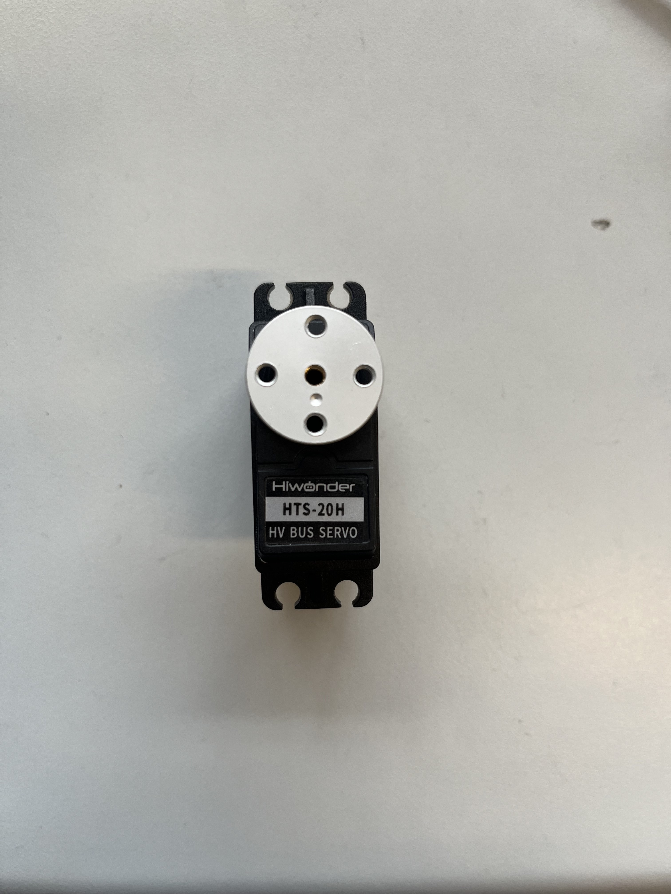
4. Cut power to the servo and screw down the aligned horn using the black center screw from the servo accessory bag.

#### Notes On Assembly Process
Some components are sensitive, or could be easily damaged during assembly. To help mitigate this, these notes are provided as important notes to keep in mind during the process.

##### Screwing Threading Plastic and Metal
The entire system is largely assembled with machine screws through 3D printed parts, with either lock nuts or captured square nuts as backing. To aid with alignment and minimize cross-threading the nuts or other components, it's recommended to first screw the machine screws all the way into the 3D printed hole, to thread the plastic and clear any debris from the 3D printing process, before unscrewing the screws, and then assembling the full joint with any nuts, servos, or motor horns screwed in once the plastic holes have been cleared and the screw screws easily into the plastic hole.

Additionally, when screwing to the metal servo horns, it is very easy to misalign your screw and cross thread the screw onto the servo horn. Clearing plastic holes first should allow you to easily hand thread the screw through the plastic into the horn, and simply finish tightening the fully inserted screw down with a hex screwdriver.

##### Servo Horn Alignment
Once a motor has been set to the default position, you can attach the metal horn with the small indent facing towards the motor body (see below image) as a useful visual reference to assist in verifying that the servo does not get misaligned or shifted during the assembly process.

##### Servo JST Cables
The JST cables that come with the servos are a very tight fit into the servo recepticals. We recommend only partially inserting them for initial assembly and testing. These partially inserted connectors will still make electrical contact for continuity testing and motor operation, while still providing more space for pliers to pull the header out without touching the wires themselves. Once operation is confirmed, the connectors can easily be pressed the rest of the way in.

Additionally, despite how tight the connectors are into the recepticals, be very careful when disconnecting them to not pull on the cable wires themselves, as this could damage the individual wires or pull them out of the JST header.

#### Neck and Torso Assembly
When assembling the neck and torso for the robot, it is best to begin with the chest, then spine, and ending with the neck. Throughout this assembly you will need to attach the motors and JST cables onto certain pieces before moving on.

The first step that is **highly** recommended is pre-setting the IDs of all of the Neck and Torso motors before beginning the assembly. 

The HiWonder HTS-20H servos involved in this assembly would be: 
 - Right Chest motor
 - Left Chest motor
 - Head Nod motor
 - Head Tilt motor
 - Head Turn motor 

The two HiWonder HTS-35H servo are also part of this section of the assembly, and are used for the torso motors.
 - Torso Bow motor
 - Torso Tilt motor
 
 All correlated motor IDs are listed above in [Initializing Servo IDs and Positions](#initializing-servo-ids-and-positions), as well as instructions for how to set the IDs and their home positions. It is also recommended that you check the servo horn orientation during this time, following the alignment found in [Servo Horn Alignment](#servo-horn-alignment).

##### Chest Assembly
The chest will require:
 - A P1 philips screwdriver
 - A M2.5 allen key
 - 12x black rubber spacers from the motor package
 - 12x silver servo horn M3 screws
 - 3x JST cables
 - 12 M3 x 16 mm hex screws
 - 8x M3 hex nuts
 - 4x M3 square nuts
 - Motor ID 3
 - Motor ID 4
 - Motor ID 8
 - the Shoulder Connector pieces
 - the chest piece

As recommended in the assembly notes, it is best to pre-thread the screw holes on the 3D printed parts. You should also have already Initialized the motor IDs and home positions with attached servo horns as described in the [initialization instructions](#initializing-servo-ids-and-positions)

Right Shoulder Chest
1. Insert the black rubber spacers into the screw slots for each of motor 4.
2. Insert motor 4 into the right shoulder slot on the chest piece. The servo should be oriented so the servo horn is closer to the back of the chest rather than the front as seen in the side photo below. Note the location of the dimple on the servo horn.
   
3. Use 4 of the M3x16 screws and 4 of the hex nuts to screw motor 4 to the chest.
4. Use 4 of the silver M3 screws to attach motor 4's servo horn to the righst side Shoulder Connector piece. It should be attached to the horn mount in the middle of the part, and the two sides of the part should be dipping "down" when attached as shown below. 
   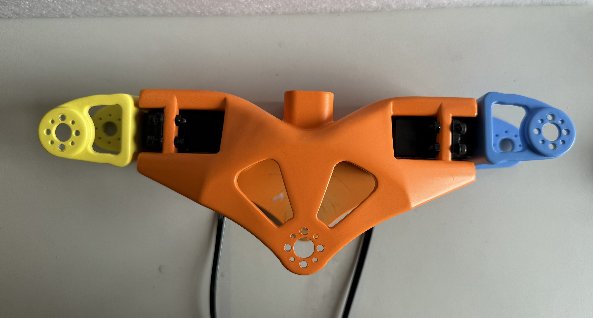
5. Attach the JST cable to the jst connector on the motor facing the back of the chest piece.

Left Shoulder Chest
6. Insert the black rubber spacers into the screw slots for each of motor 8.
7. Insert motor 8 into the left shoulder slot on the chest piece. The servo should be oriented so the servo horn is closer to the back of the chest rather than the front.
8. Use 4 of the M3x16 screws and 4 of the M3 hex nuts to screw motor 8 to the chest.
9. Use 4 of the silver M3 screws to attach motor 4's servo horn to the righst side Shoulder Connector piece. It should be attached to the horn mount in the middle of the part, and the two sides of the part should be dipping "down" when attached as shown below.
   
10. Attach the JST cable to the jst connector on the motor facing the back of the chest piece.

With both motors installed and JST cables connected, the chest from behind should look like 

Neck Chest
11. Insert the black rubber spacers into the screw slots for each of motor 3.
12. Insert 2 of the M3 square nuts into the slots in on the inside of the neck of the chest piece, as shown below.
   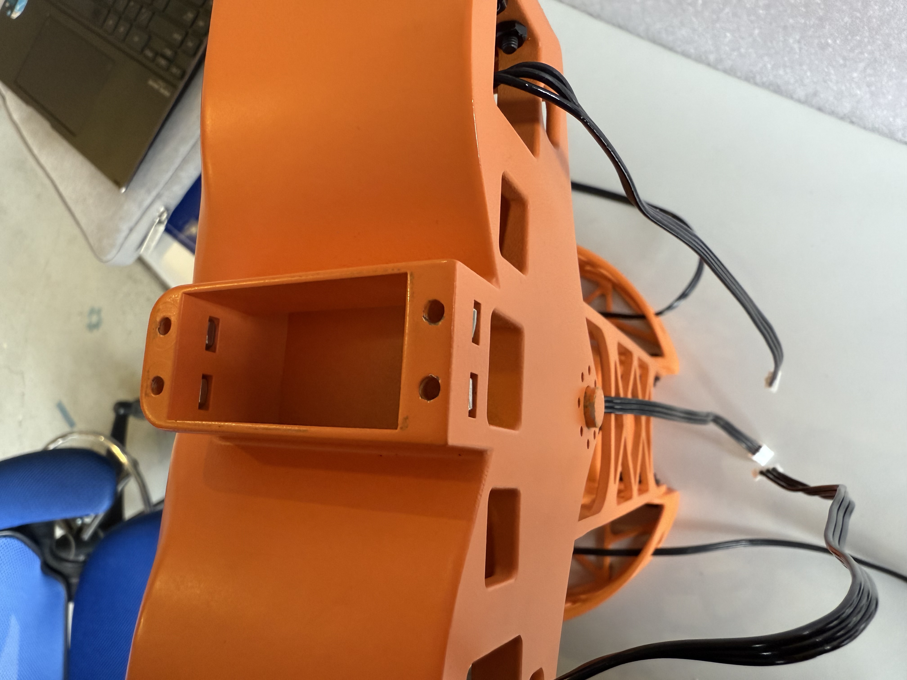
13. Insert motor 3 into the neck of the chest piece. The servo should be oriented so the servo horn is closer to the back of the chest rather than the front.
14. Insert the remaining 2 M3 square nuts into the slots on the back of the neck of the chest piece.
15. Use the remaining 4 M3x16 hex screws to screw down motor 3 to the chest, making sure to screw into the square nuts.
16. Attach the neck piece to the servo horn with 4 silver M3 screws, matching the orientation shown below.
   
17. Attach the JST cable to the jst connector on the motor facing the back of the chest piece.

The chest assembly will be fairly simple as you’ll be attaching the Right Chest, Left Chest, and Neck motors, then at the end, adding the Chest Connector piece that you just put together. The most difficult part of this assembly will be adding the Chest Connector piece onto the Chest.

For the Right and Left Chest motors add the black rubber spacers to all screw notches available, then attach them to their respective sides with the servo horn pins pointing away from the front of the chest. Next, use the M3 x 14 mm hex screws and hex nuts to attach the motors to the chest frame. After the motors have been attached, you can add JST cables to the connection points located on the back of the chest frame. The progress so far should look like the figures below:

Now, you can add the motors’ servo horns with the black M3 screws, then the Shoulder Connector pieces. You’ll want the orientation of the Shoulder Connector pieces to match the placement of the Chest motors. You can attach the Shoulder Connector pieces using the silver M3 screws. The final product should look like the figures below:

##### Chest Connector Assembly
The Chest Connector assembly will require:
 - an M3 hex screwdriver
 - 8 rubber spacers from the motor packages
 - 2 black M3 screws from the motor packages
 - 8 square M3 nuts
 - 8 M3 x 16 mm hex screws
 - 2 servo horns
 - 8 servo horn M3 screws
 - 2 JST cables
 
As recommended with every step, it is best to pre-thread the screw holes on the 3D printed parts.

Begin by attaching the Chest Connector motors in the connector piece. Be aware of where you place certain motors as you’ll want your ID to match the movement that it will make on the robot. For example, Motor #18 will make a side-to-side movement while Motor #19 will be in charge of the up-down movement. 

The placement of these motors can be a little tricky, so a visual will be provided below to help orient them correctly along with the JST connections. A good rule of thumb for this connector piece is to have the motor shaft in-line with the pins located on the 3D printed piece. The figures below shows correct placement and JST cable paths:

Now, add all the rubber spacers onto the screw notches of the motors and begin adding the screws until you barely reach the M3 square nut opening. Place the M3 square nuts in their corresponding spaces and continue tightening the screws completely. You might have to tilt the 3D printed piece a bit to keep the square nuts in their place.

After finishing the connector piece you can attach the servo horns using the black M3 screws. These servo horns will attach the piece to both the spine and the chest piece. Now begins the tricky part, attaching the Chest Connector to the chest piece.

To make this as simple as possible, begin by attaching the front motor (the one that will attach to the chest piece) first. You will want to attach this upside down to its placement, then rotate it into its correct position after fitting the Chest Connector in correctly. A correct placement means that both the servo horn and the pin (on the back of the chest piece) are both slotted into their designed positions. The figures below show the assembly process and final product:

##### Spine Assembly
The Spine assembly will require:
 - an M3 hex screwdriver
 - 4 silver servo horn M3 screws from the motor package
 - 8 hex nuts
 - 8 M3 x 14 mm hex screws

As recommended with every step, it is best to pre-thread the screw holes on the 3D printed parts.

To begin assembling, attach the frame of the spine to the hips. It is important that you attach the spine by the screw attachments that don’t include the servo horn location. It is also recommended that you screw in the spine with four screws in a diamond shape (the only screw holes that M3 screws will fit). This will give you a stable base for you to attach the rest of the torso on. This step should not impede instructions provided later for the Lower Body Assembly.

The figure below shows screw placement:

Following the attachment to the hips is attaching the Chest assembly to the Spine. There should be a servo horn left on the Chest Connector that is orientated in the same direction as the available horn slot on the Spine. Attach the Chest to the Spine using this connection point with the silver M3 screws.
The final product should look like the figures below:

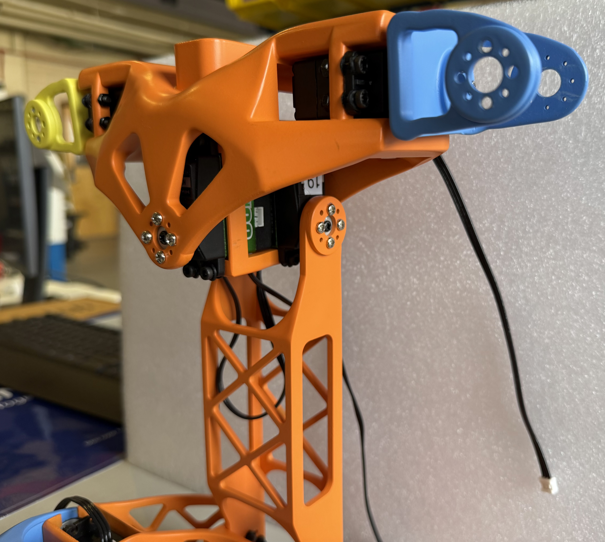
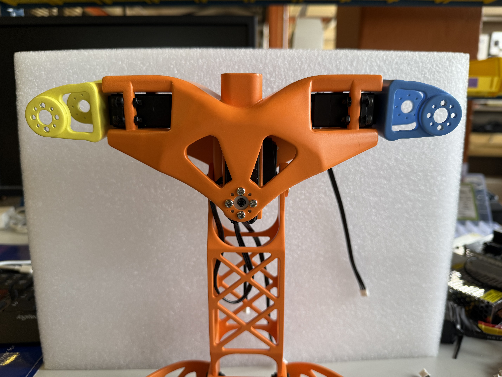
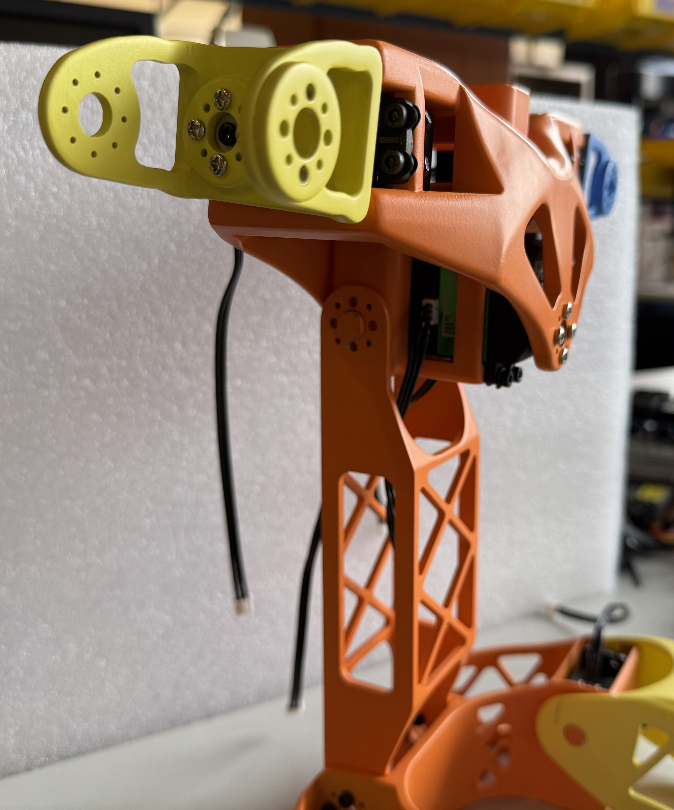

##### Neck Assembly
The neck will require:
 - an M3 hex screwdriver
 - 1 servo horn
 - 1 black M3 screw from the motor package
 - 4 black rubber spacers from the motor package
 - 4 silver servo horn M3 screws
 - 1 JST cable
 - 4 M3 x 16 mm hex screws
 - 4 M3 square nuts

As recommended with every step, it is best to pre-thread the screw holes on the 3D printed parts.

First, add the black rubber spacers to all screw notches of the Neck motor. Next, you’ll want to add 4 square nuts to the spaces available on the empty motor space on the top of the chest piece. Using the M3 x 16 mm screws, attach the Neck motor. Next, add a servo horn using the silver M3 screws to the placement located on the bottom of the Neck piece. It will be easier to add the servo horn to the piece first than attaching it to the motor. After attaching the servo horn onto the Neck piece, you can add the Neck piece onto the Neck motor and secure it with a black M3 screw.

At this step you can also add a JST Cable to the port opening located on the back of the chest frame. The final product should look like the figures below:

##### Neck Connector Assembly
The Neck Connector will require:
 - an M3 hex screwdriver
 - 2 servo horns
 - 8 servo horn M3 screws
 - 2 black M3 screws from the motor packages
 - 8 black rubber spacers from the motor packages
 - 3 JST cables
 - 8 M3 x 16 mm hex screws
 - 8 square nuts

As recommended with every step, it is best to pre-thread the screw holes on the 3D printed parts.

Begin by adding the rubber spacers to all screw notches on your Neck Connector motors, then you can begin attaching the motors in the connector piece using the M3 x 16 mm screws. Be aware of where you place certain motors as you’ll want your ID to match the movement that it will make on the robot. For example, Motor #1 will make a side-to-side movement while Motor #2 will be in charge of the up-down movement. After adding the motors you can attach their servo horns using the black M3 screws.

The placement of these motors can be a little tricky, so a visual will be provided below to help orient them correctly along with the JST connections. A good rule of thumb for this connector piece is to have the motor shaft in-line with the pins located on the 3D printed piece. The figures below shows correct orientation and JST cable paths:

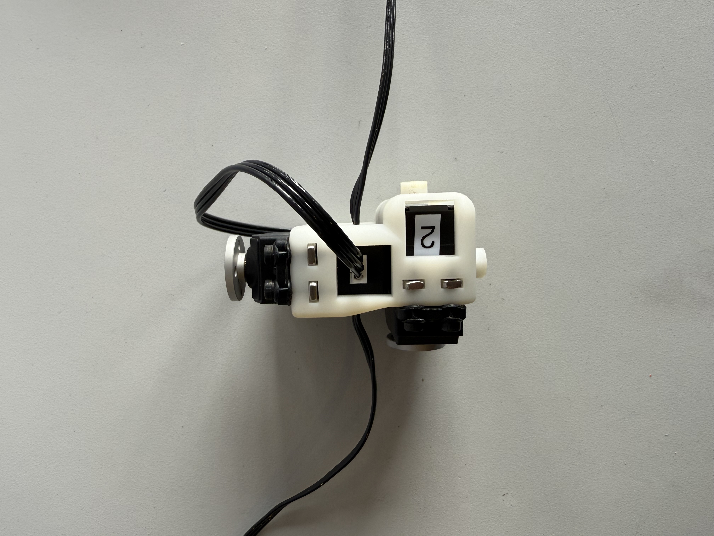

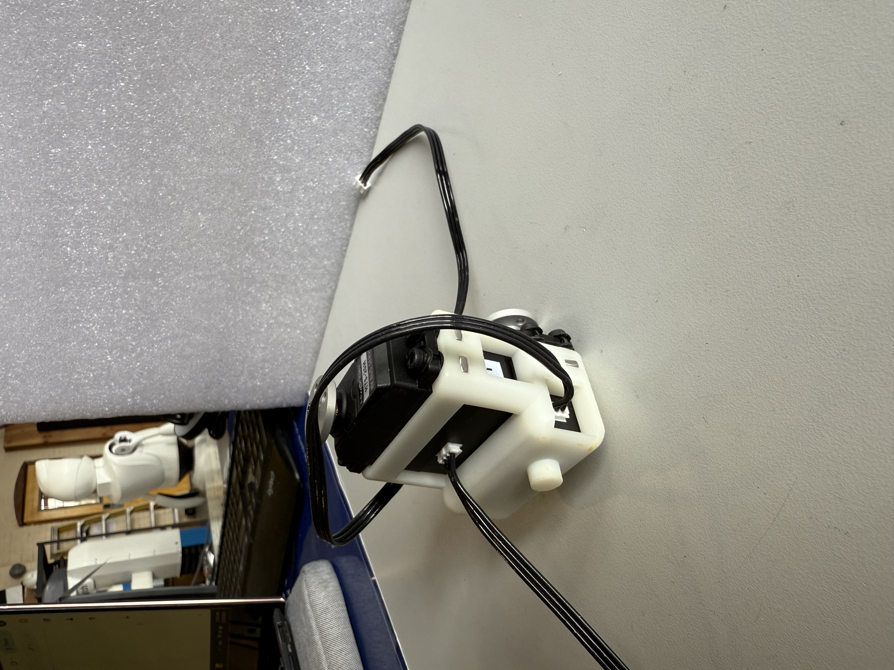

##### Head Assembly
The Head Assembly will require:
 - an M3 hex screwdriver
 - 8 silver servo horn M3 screws from the motor package
 - 2 M3 x 20 mm screws
 - 2 M3 square nuts 

As recommended with every step, it is best to pre-thread the screw holes on the 3D printed parts.

You will first want to attach the Neck Connector piece to the Neck piece that should be attached to the Chest piece at this point. Motor #1 should be attached to the servo horn placement on the Neck piece, and secured with the silver M3 screws. Next, you’ll want to use the piece that looks like U (this piece will help us attach the headshell later) and attach it to Motor #2 located on the Neck Connector piece. 

Next, insert the square nuts into the square slots on the U-shaped piece. Be sure to use a tool to push them as far in as they can go. You can check if they are in the right place by peering through the screw hole to see if the holes line up. See the figure below for a clearer visual (at this step the LED panel can be added, but optional):

After, you can place the headshell on top of this U-shaped piece by aligning the cylinder extrusions of the headshell with the cylinder-shaped gaps on the U piece. The two should fit snug and you should be able to press the headshell down to secure the fit. You can then complete the headshell’s attachment by screwing in the M3 x 20 mm screws until they reach past the square nuts. The final product should look like the figures below:

#### Arm Assembly
When assembling the arms for the robot, it is best to begin with the bicep, then shoulder, and ending with the forearms. This is due to the slight complexity behind the arm assembly. You will need to attach the motors and JST cables onto certain pieces before moving on.

The first step that is **highly** recommended is pre-setting all of the Arm motors before beginning the assembly. 

The HiWonder HTS-20H servos involved in this assembly would be:  - Right Shoulder
- Right Bicep
- Right Elbow
- Left Shoulder
- Left Bicep
- Left Elbow 

The forearms will require one Actuonix PQ12 Micro Linear Actuator each. 

All correlated motor IDs are listed above in [Initializing Servo IDs and Positions](#initializing-servo-ids-and-positions), as well as instructions for how to set the IDs and their home positions. It is also recommended that you check the servo horn orientation during this time, following the alignment found here [Servo Horn Alignment](#servo-horn-alignment).

##### Biceps
The biceps will require:
 - an M3 hex screwdriver
 - 2 servo horns
 - 2 black M3 screws from the motor package
 - 4 black rubber spacers from the motor package
 - 4 JST cables
 - 4 M3 x 18 mm tapered screws
 - 4 M3 x 20 mm hex screws
 - 4 M3 square nuts
 
As recommended with every step within the assembly, it is best to pre-thread the screw holes on the 3D printed parts.

Beginning with the top motor placement on the bicep, attach 2 JST cables onto the back and right side of the Right Bicep motor (switching the right side to left for the Left Bicep motor). After completing this step, add the square nuts to their corresponding spaces on the inside of the Biceps. If you look at the screw hole from a top view, you shouldn’t be able to see the M3 square nuts. If you can, this means that the screw holes from the Bicep pieces and the nuts are not aligned correctly. After aligning the nuts correctly, place the motors into the top motor space which should give you a prescribed alignment. Screw the motors in place using the M3 x 25 mm screws. The placement should mimic the figure below:

Bicep references with JST cables:

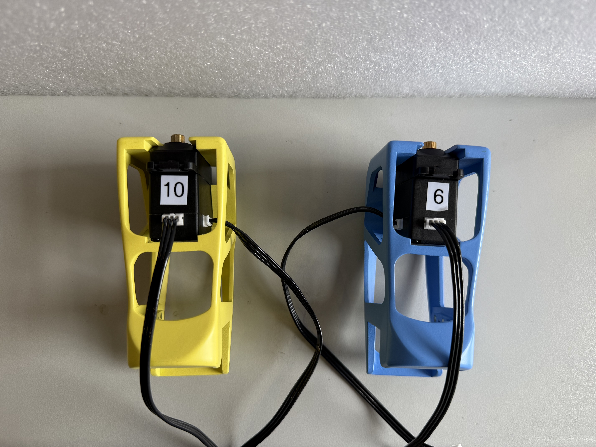
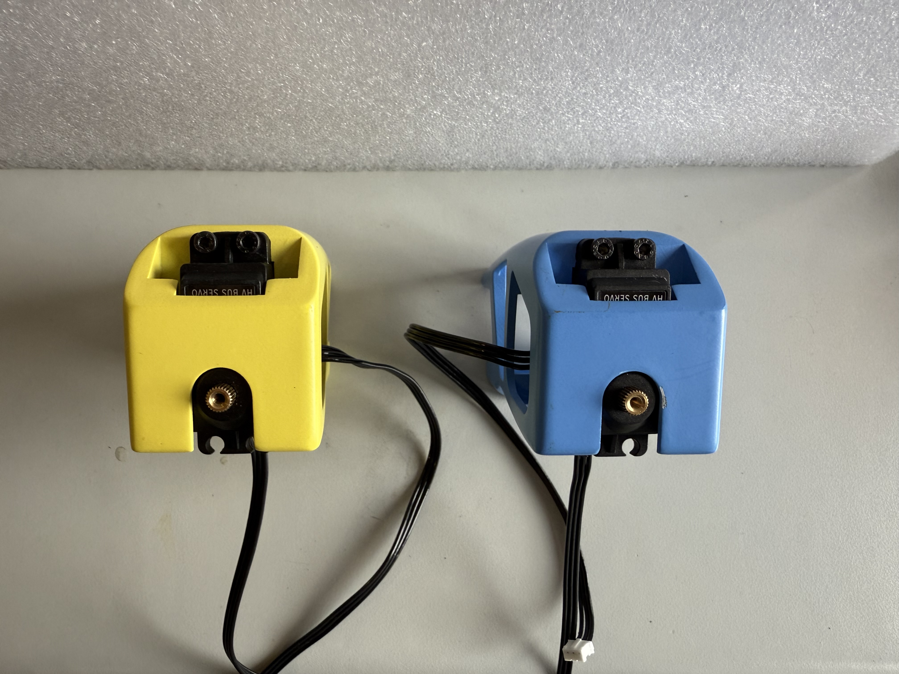

Next, add 2 rubber spacers to the screw holes opposite to where the servo attaches on the lower Bicep motors. Then, attach the lower Bicep motors to the lower motor placement available using the tapered M3 x 18 mm screws with their servo horns already included (using the black M3 screws). The motors should be aligned where the screw holes with the rubber spacers match up with the screw holes on the 3D printed piece. The end result should allow for the servo horn of the lower Bicep motors to be attached to the Forearms. Lastly, connect the JST cables located on the right or left side of the upper Bicep motors to the back available connection of the lower Bicep photos. The figures below will include highlighted JST cable paths.
The final products should look like the figure below:

Final products (Right motor and Left motor):

##### Shoulders
The Shoulders will require:
 - an M3 hex screwdriver
 - 8 silver servo horn M3 screws
 - 2 black M3 screws from the motor package
 - 4 black rubber spacers from the motor package
 - 4 JST cables
 - 4 servo horns
 - 4 M3 x 16 mm hex screws
 - 4 M3 square nuts. 
 
As recommended with every step, it is best to pre-thread all screw holes in the CAD model. This is especially important for the Shoulders due to the uniqueness of its screw placements. 

Before placing the Shoulder motors in the 3D printed piece, attach servo horns on the bottom of the 3D piece using the silver M3 screws. This will be the servo horns meant to connect to the upper motors of the Bicep assembly that you just completed. Make sure to align the horns correctly according to the upper Bicep motors. To make this step easier, feel free to attach the servo horns onto the upper Bicep motors, **don’t screw them down yet**. Then, screw the Shoulder piece onto the horn. The outcome should look like the figure below:

Outcome of servo horn attachment:

Next, add rubber spacers to the screw holes closest to the servo horn attachment on the Shoulder motors. Put the Shoulder motors into the 3D printed piece with the label facing outward and the servo horn attachment orientated on the top. You can then screw the motors in place using the M3 x 14 mm hex screws and adding the M3 square nuts into their corresponding slots. It might take a bit of fussing to get the M3 square nuts aligned correctly with the screws. You can tilt the piece to help make this a bit easier. 

After screwing the motor in place, you can screw on the servo horns and attach the JST cables (connected to the back of the upper Bicep motors) to the outer sides of the Shoulder motors. Right side for the Right Shoulder, and left side for the Left Shoulder. Additionally, attach JST cables to the inside of the Shoulder motors, which will later connect to the upper Chest motors. The figures below will include highlighted JST cable paths.

Final product:

##### Forearms
The Forearms will require:
 - an M3 hex screwdriver
 - 8 silver servo horn M3 screws

Upon pre-threading all the screw holes, you can move onto the complete Arm Assembly (you will be using these screws in the assembly).

##### Hands Construction & Assembly
Before beginning assembly, please be sure to double check that the hinges match the size-dependent and axial orientation on the fingers, with the fingers aligned to their corresponding palm (*Figures 1-3*). It is **highly** recommended to fit the largest hinges into the palm first. While the hinges should be printed as a more "spongey" material, you may need to use a pair of pliers to manually squeeze the larger side of the hinge into its gap in the palm. You can also use a file or a craft knife to trim a little from the opening sides. After fitting the palm hinges, all fingers can be assembled separately from the hand. They should perfectly slide into the finger hinge slots (following size contraints but axial orientation shouldn't matter). 

Stringing the fishing line through the hands should be the **last step** (with fingers not yet assembled to the palm). Begin by measuring the amount you think you might need for your project by fitting the line through the bottom of the hand and up through the 3D piece (**do not cut yet**). Then, continue stringing your fishing line up the holes in the fingers and upon reaching the tip of the top finger, restring back through the second hole and leaving enough to tie it off (*Figure 4*). To get an accurate length of fishing line you will need, attach the finger to the palm and measure how much you think you will need at the bottom of the hand (leaving adequate space at the top to tie off your line). After ensuring you have the right length, you can cut off your line from its container and use pliers to tie a double knot at the top of the finger.

*Figure 1*: Composition and BOM of Flexy-Hand 2 ([Flexy-Hand 2](https://www.thingiverse.com/thing:380665))

*Figure 2*: Finger plate with labeled orientation ([Flexy-Hand 2](https://www.thingiverse.com/thing:380665))

*Figure 3*: Hinge orientation for all fingers ([Flexy-Hand 2](https://www.thingiverse.com/thing:380665))

*Figure 4*: Tendon knot placement for all fingers ([Flexy-Hand 2](https://www.thingiverse.com/thing:380665))

##### Arm Assembly
At this point in the Arm assembly process, the Biceps and Shoulders should already be connected together due to the slight complexity of their pieces. The only step left is to attach the forearm to the lower Bicep motor, which can be done by screwing the servo horns from the lower Bicep motors to their corresponding places on the Forearms. This will be accomplished using the silver M3 screws you grabbed for the Forearm section. The finished assembly should look like the figures below:

Final assembly (Right Arm):

#### Lower Body Assembly
When assembling the lower body it is best to start with the feet and then work your way up to the upper legs. This ensures that you will have everything aligned and allows you to plug the corresponding JST cables as you go.

The first and foremost step that is **highly** recommended is pre-setting all of the Lower Body motors before beginning the assembly. 

The HiWonder HTS-20H servos involved in this assembly would be:
 - Right Hip
 - Right Knee
 - Right Ankle
 - Left Hip
 - Left Knee
 - Left Ankle
 
All correlated motor IDs are listed above in [Initializing Servo IDs and Positions](#initializing-servo-ids-and-positions), as well as instructions for how to set the IDs and their home positions. It is also recommended that you check the servo horn orientation during this time, following the alignment found in [Servo Horn Alignment](#servo-horn-alignment).

##### Feet
Next up is the feet. The feet are a fairly quick and simple set-up that will require:
 - an M3 hex screwdriver
 - 8 silver servo M3 screws
 - 2 servo horns
 - 2 black rubber spacers from the motor package
 - 2 black M3 screws from the motor package
 - 2 JST cables
 
Begin by pre-threading the plastic screw holes with the silver M3 screws, then attach the servos by aligning them upright to the sky. Add the rubber spacers onto the screw notches that will attach to the lower legs as this will help stabilize our screws in the frame (see figure below). Lastly, attach the JST cables into the space on the back of the servos. The final product should look like the figure below.

Final product:

**Note that the cable path is incorrect in this figure, you should use the JST connection on the other side of the motor that will keep the JST cable from being pinched from ankle movement**

##### Lower Legs
Following the set-up of the feet are the lower legs of the robot. Repeat these steps for both the right and left lower legs.

Each lower leg will require:
 - a hex screwdriver
 - Knee Servo Motor
 - 1x black M3 screw from the motor package
 - 2x rubber spacers included in the motor package
 - 1x metal servo horn
 - 4x silver servo horn M3 screws
 - 2x tapered M3 x 18 mm screws
 - 2x M3 nuts
 - 1x JST cables

As done the same with the feet, pre-thread all the screw holes on the lower legs before beginning assembly. Setting the lower legs in place on top of the ankle motors, begin screwing the legs in place using the tapered screws and hex nuts. We are now half-way through the step. The half-way product should look like the second figure below.

Half-way point:

Next, attach the Ankle JST cables to the bottom of the Knee motors, and a new JST cable onto the right side of the Left Knee motor. The Right Knee motor will have a new JST cable onto the left side. Finally, orient the Knee motors correctly onto the lower legs which should follow a 90 degree angle (the robot is sitting). Add rubber spacers onto the lower screw notches of the motor, where the upper legs will be attached.The figures below will show the final product, with JST cable, rubber spacer, and Knee motor orientation. 

Final product, Left Leg:

Final product, Right Leg:

##### Upper Legs
Continuing now to the upper legs. The upper legs will require:
 - a hex screwdriver
 - 4x tapered M3 x 18 mm screws
 - 4x M3 hex nuts 
 
 Following the similar process from the other limbs, pre-thread all the screw holes before beginning assembly. Next, you can attach the lower end of the upper legs by attaching it to the motors on the upper part of the lower legs (using the tapered screws). Keep in mind that the JST cable for the Knee motors will need to run through the skeleton of the upper leg (see reference below). The final product should resemble the figure below.

Final product, Left Leg:

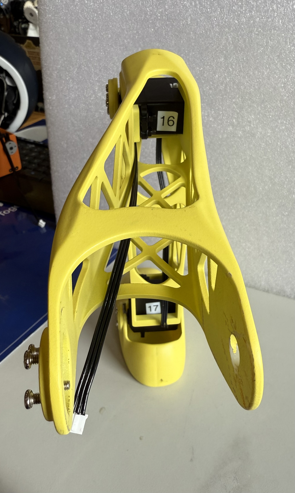

Final product, Right Leg:

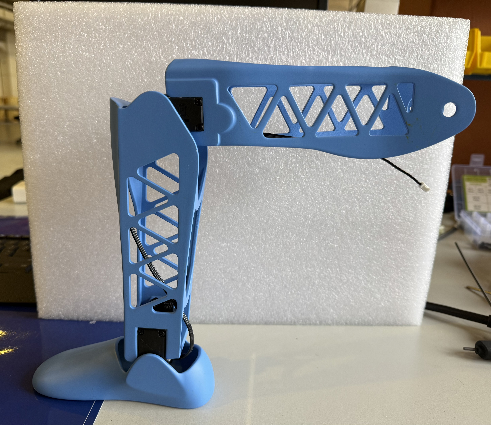

##### Hips
Finally, we reach the end of the Lower Body Assembly. The hips will require:
 - a M3 hex screwdriver
 - 2x metal servo horns
 - 8x silver servo horn M3 screws
 - 2x black M3 screws from the motor package
 - 4x rubber spacers from the motor package
 - 4x M3 x 25 mm hex screws
 - 4x M3 square nuts
 - 2 JST cables. 
 
As usual, pre-thread all the screw holes, **especially**, where the motors are attached to the hips. 

Next, add the rubber spacers onto the screw notches of the motor (pictured below) and following comes the trickiest part of the Lower Body Assembly. Place the motors inside their corresponding slots in the hips (following corrent orientation) and firmly press them down until you can see the rubber spacer peek out a little underneath. This does not mean you are trying your best to push the motor down so much that you damage material, but pressing it down enough that it stops moving and the screw holes are aligned. You can check this by screwing in one of the M3 x 30 mm screws and seeing if you feel a lot of resistance. There will exist some resistance (due to the spacers), but not enough that it feels like you will snap the hip upon using a hex screwdriver. 

After you have your motors settled with the screw holes aligned, make sure one of the screws is fitted far enough you can see it beginning to reach the square gap but not sitting in it at all (pictured below). Now, flip the 3D printed piece upside down so you are seeing the flat printed bottom. Insert a M3 square nut into one of the rectangular slots and align it with your incoming screw. **This step will take the most adjusting!** Try to continue screwing in the M3 x 25 mm into the piece and seeing if it captures the M3 square nut correctly. If it is meeting a lot of resistance or won't continue screwing, **retry**. Otherwise you might snap some material off. Tip: try tilting the hips at an angle if the M3 square nut is falling through too much, or if a bottom layer exists (usually from the 3D printing process), drop the nut from the top and fit it appropriately in its slot. 

Following this step you can attach the servo horn onto the motor and JST cables protruding from the **back** connection of the Hip motors. The final product should look like the figure below:

Final product:

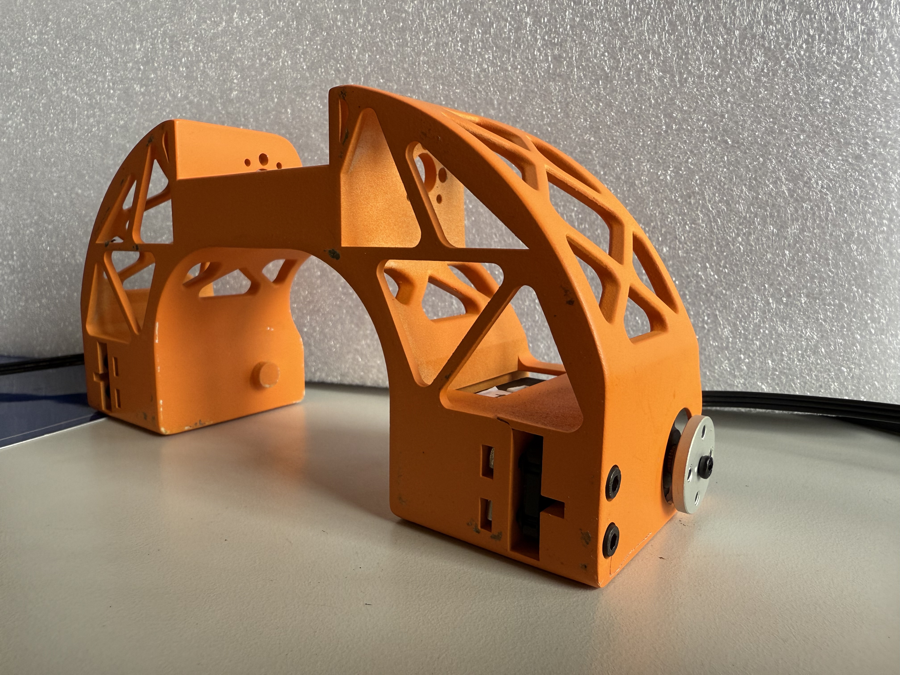

After, you can attach the lower limbs to the hip by screwing the Upper Legs into place on the Hips' servo horns (using the silver M3 screws). The final assembly should look like the figures below:

**In this figure, the JST cables connected to the Hips are wired incorrectly. You should use the back JST connection to attach your Hip cables**

#### Final Assembly
PCB and electrical box wiring goes here

### Sensor Box Assembly Instructions

### Caption System Assembly Instructions

## Mechanical Information

### Robot Joint Rotation & Home Position Reference
Below is a listing of the safe operation ranges and home angle positions for each robot joint. In addition to this are images showing the robot in home position, along with the rotational position corresponding the the minimum and maximum positions for each joint, for reference when designing behaviors.

Specifications on Motor Motion:

Nod: "up-down"

Turn: "left-right"

Tilt: "side-side"

Bow: "up-down"

Pitch: "up-down"

Roll: "side-side"

Twist: "side-side"

|     Joint Name       | Min | Max | Home |   |
|----------------------|-----|-----|------|---|
| Head Nod             | 0   | 240 | 125  |   |
| Head Turn            | 0   | 240 | 120  |   |
| Head Tilt            | 0   | 240 | 125  |   |
| Torso Bow            | 40  | 140 | 125  |   |
| Torso Tilt           | 40  | 140 | 115  |   |
| Right Shoulder Pitch | 0   | 180 | 125  |   |  
| Right Shoulder Roll  | 0   | 180 | 185  |   |
| Right Arm Twist      | 0   | 180 | 115  |   |
| Right Elbow          |     |     | 90   |   |
| Right Gripper        |     |     |      |   |
| Left Shoulder Pitch  | 0   | 180 | 115  |   |
| Left Shoulder Roll   | 0   | 180 | 85   |   |
| Left Arm Twist       | 0   | 180 | 115  |   |
| Left Elbow           |     |     | 105  |   |
| Left Gripper         |     |     |      |   |
| Right Hip            |     | 180 | 90   |   |
| Right Knee           | 45  | 180 | 90   |   |
| Right Ankle          | 45  | 135 | 90   |   |
| Left Hip             | 0   | 160 | 90   |   |
| Left Knee            | 0   | 135 | 90   |   |
| Left Ankle           | 45  | 135 | 90   |   |

 
 

## Electrical Information
The [Electrical](./Electrical/) subfolder contains detailed information on fabricating and assembling the custom PCBs for both the robot itself as well as the sensor box.

## Future Improvements
More involved improvements for future development, in no particular order
 - Add hip roll/out at side flexor motors
 - Add foot side-side turn motor
 - Add a torso twist motor
 - Separate the servo joint sections from the rest of the body links, so we can make different shape designs for the limbs/torso without needing to re-zero or re-assemble the motors

## References
 - [Flexy-Hand 2](https://www.thingiverse.com/thing:380665)
 - 

